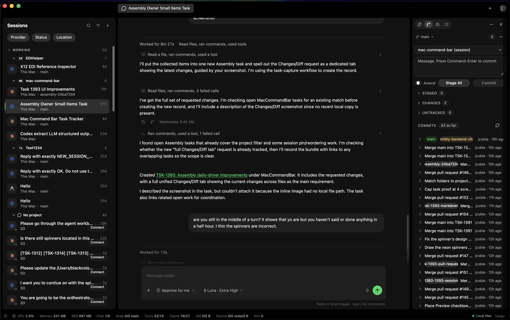

# Assembly

**A fast, lightweight desktop workspace that is half AI agent chat and half IDE.**

Assembly puts your coding-agent conversations and your project in one window. Talk to Codex, Claude Code, or Antigravity in a chat built for long agent sessions, then read, edit, diff, commit, and ship the result without switching to another tool. The editor is light by default. Flip on **Supercharged** and it starts language servers so you get diagnostics, go-to-definition, and live reference counts.

It runs on your Mac, or you can keep everything on a remote Linux machine (projects, Git, agent sessions, and the AI providers themselves) and use Assembly on your Mac as the client.

> Assembly is under active development. The GitHub repository still carries its original name, `mac-command-bar`. The app is built with Tauri 2, Svelte 5, TypeScript, and Rust.

[Releases](https://github.com/jcoble/mac-command-bar/releases) · [Issues](https://github.com/jcoble/mac-command-bar/issues) · [Architecture guide](main-architecture-explained.html) · [Contributing](CONTRIBUTING.md)


<!-- screenshot: Supercharged editor with reference counts and the problems list -->
<!-- screenshot: pull request workspace with the side-by-side diff -->
<!-- screenshot: Settings → Connections with a remote machine connected -->

## Why Assembly

Agent chat apps such as the Codex app and T3 Code are good at conversation but leave the code to another program. IDEs are good at code but are heavy, and agent chat is bolted onto the side. Assembly is built to do both jobs in one window:

- **Half agent harness.** Run several agent sessions per project, follow their tool calls as they stream, answer permission prompts inline, steer a running turn, and resume past sessions from the providers' own history.
- **Half IDE.** A file tree, a CodeMirror editor, a Markdown reader, a diff editor, Source Control, worktrees, terminals, a browser, and pull requests sit around the conversation.
- **Light by default.** Memory and CPU are treated as product requirements, not polish. Heavy features such as language servers start only when you ask for them, and they stop when you leave.

## Feature tour

### Agent conversations

- Codex, Claude, and Antigravity sessions run through Agent Client Protocol (ACP) adapters that ship with the app and update on their own.
- Pick the model, reasoning effort, and access mode for each session. Attach screenshots and images.
- Send a message while a turn is running to steer it. Approvals, permission requests, and questions from the agent appear in the conversation.
- Tool calls, file edits, plans, reasoning, and subagent work stream into the timeline. Each turn lists the files it changed.
- The **Context** panel shows a session's model, effort, access mode, token use, files, and attachments.
- The **Helper** writes session titles, answers Inspect questions, and drafts PR reviews. It uses your signed-in Codex or Claude CLI by default; API keys are an explicit opt-in in Settings.
- A command palette opens with **⌘K** or **⇧⌘P**.

### Resume old sessions

- **History** scans the session logs that Codex (`~/.codex/sessions`) and Claude Code (`~/.claude/projects`) write on disk, by workspace, project, or everything.
- **Resume as Assembly Session** imports the transcript and hands the conversation back to its agent with the original provider session ID, so the agent keeps its own context.
- You can also copy the provider's resume command (for example `codex resume <id>` or `claude --resume <id>`) to continue in a terminal.
- Antigravity sessions started in Assembly resume through the provider's own session ID. Importing Antigravity history written outside Assembly is not supported yet.

### Agent workflows

- In **Agents → Workflows**, start a workflow from a task. The default runs Plan → Build → Review, and you choose the provider for each stage.
- Save your own templates with more stages, such as spec check, verify, open PR, PR review, and merge. A stage can send work back to an earlier stage, and an approval gate can hold the run until you sign off.
- While a workflow runs you can pause it, approve a handoff, retry or skip a stage, hand a stage to a different provider, or cancel, with a live view of each run.

### Editor: light by default, Supercharged when you need it

- The editor is CodeMirror 6, with syntax highlighting for the common languages, project-wide search, file history, and image preview.
- **Editor mode** (the default) starts no language server. Files open fast and cost little.
- **Supercharged** is a switch in the editor status bar and in **Settings → General → Supercharged**. With it on, a language server starts when you open a supported file:
  - C# (Roslyn), TypeScript/JavaScript, and Rust (rust-analyzer), each with its own on/off switch.
  - Diagnostics in a problems list, hover, completion, go-to-definition, Peek References, and reference counts above symbols.
- One project owns the language servers at a time. Switching projects stops the previous project's servers, and turning Supercharged off stops every server that is running.

### Markdown, diffs, and the browser

- Markdown files switch between Source and a rendered Preview per file. The preview supports GitHub-style alerts, footnotes, KaTeX math, and Mermaid diagrams.
- The diff editor has unified and side-by-side views, collapses unchanged regions, shows multi-file diffs, and jumps from a hunk to the line in the editor.
- The built-in browser is a native web view inside the workspace. It opens local dev servers, `file://` pages, and websites, and remembers the page per session.
- Mark up a page with element selection, a region drag, or a freehand marker, then send it to the agent with a note from the browser's mini-composer.

### Source control, worktrees, and pull requests

- **Source Control** covers stage, unstage, discard, commit, amend, branches, stashes, fetch, pull, push, and publish, with a commit graph and per-file history.
- **Worktrees** lists a project's worktrees and creates new ones for separate streams of work. It will not remove the main checkout or a dirty worktree.
- **Pull requests** lists PRs (everyone, mine, or waiting for my review). Open one to read its description, activity, checks, and changed files in the full-width diff.
- Comment on lines, reply, submit a review (draft it with the Helper and edit it first), and merge with merge, squash, or rebase. GitHub actions go through the GitHub CLI (`gh`), so your permissions and branch rules apply.

### Notion tasks

- Connect a Notion database from the **Tasks** panel. Sign-in uses Notion OAuth.
- Search and filter tasks by status and priority, read a task's page inside the app, and change its status without opening Notion.

### Terminals, run actions, and resources

- Integrated terminals use xterm.js on a native PTY from the Rust backend.
- **Run** stores per-project commands with keyboard shortcuts, shows running processes and their output, and can open a preview URL once a server is up.
- **Resources** shows running processes with their CPU and memory, grouped by owner, and lets you stop them after a confirmation. It also shows disk use by folder and leftover Playwright browsers.
- **Usage** shows provider quota windows, token history, and estimated cost, built from the providers' local logs.

## Built to stay light

Assembly exists because the tools it replaces are slow and heavy. Every change is judged against memory and speed. These are the main techniques in the code today:

- **Rust does the heavy lifting.** Git, the file system, search, terminals, process sampling, language-server lifecycles, and the SQLite session store all run in the Rust backend, not in the web view.
- **Idle agents cost nothing.** An agent's adapter process runs only while a turn is active. Once a turn and everything it started are finished, the runtime is suspended and its process group stops. The next message resumes the same provider session.
- **Switching sessions releases memory.** On a session switch, the editor drops its document, language-server client, and per-file state, and panels unload their content. Only the session you are looking at keeps its full view in memory.
- **Language servers only on request.** They run only while Supercharged is on, one workspace per language at a time, and their whole process group is stopped when you switch away or switch off.
- **Long lists are virtualized.** Conversation timelines use `@tanstack/svelte-virtual`, the file tree is windowed, and other long lists use `content-visibility`.
- **Load on first use.** Panels load nothing until they are shown. Settings, the docking layout, KaTeX, and the C# language client are loaded on demand.
- **Event-driven, not polling.** The file tree follows a native file watcher. A test (`pnpm test:async-lifecycle`) checks every timer in the frontend against an allow-list.
- **Animations must end.** Looping animations are allowed only while real work is happening. CSS `:has()` is banned because it made WebKit re-check styles on every DOM change.

Two working targets from the project rules ([AGENTS.md](AGENTS.md)): the app should sit near 0% CPU at idle, and clicking a session should be interactive in under about 350 ms.

One measured checkpoint, from [the September reliability pass](docs/reports/2026-09-13-assembly-reliability-hardening.html) on a development machine:

- After repeated Browser and History switches, the main process held about 92 MB of resident memory at 0–0.4% CPU.
- While a reply was streaming, the whole app peaked at 651 MB physical footprint and settled to 252 MB after the turn was cancelled.

These are checkpoints, not a benchmark. Memory is judged in Activity Monitor, because the Web Inspector inflates it.

## Run it local or remote

Every project belongs to a machine. A local project uses the Rust backend inside the app. A remote project uses the Assembly backend running on a Linux server, reached over SSH:

```text
 Your Mac                                         Linux server (x86-64)
┌───────────────────────────┐   SSH tunnel   ┌────────────────────────────────┐
│ Assembly desktop app      │ ─────────────▶ │ assembly-remote-server         │
│  UI, editor, local cache  │   WebSocket    │  (systemd user service,        │
│  of remote history        │ ◀───────────── │   listens on 127.0.0.1:7777)   │
└───────────────────────────┘                │  agent sessions + providers    │
                                             │  files, search, Git, worktrees │
                                             │  GitHub PRs, sessions.db       │
                                             └────────────────────────────────┘
```

- **Connect** in **Settings → Connections** by adding an SSH target such as `you@server`. Assembly uses your system `ssh` with key-based login, opens a tunnel to the backend, and authenticates with a token kept on the server.
- **Install, update, and uninstall** the backend from the same screen. The installer downloads the latest signed `assembly-backend-v*` release onto the server, checks its signature and checksum, and sets up a user-level systemd service. Uninstall can keep or delete the server's data.
- **Everything can stay on the server.** Agent sessions, the provider CLIs and their credentials, the repository, Git, worktrees, and GitHub calls all run there. Only the interface runs on your Mac.
- **History is cached locally**, so remote conversations stay readable after a restart or a dropped connection. Disconnecting or removing the machine clears that cache.
- **Server requirements:** Linux x86-64 with `systemd`, Python 3.9 or newer with SSL, and `sha256sum`, `openssl`, `ss`, `awk`, and `grep`.
- **What gets installed:** the binary at `~/.local/bin/assembly-remote-server`, its configuration in `~/.config/assembly/server.env`, and its data under `~/.local/share/assembly`.

Terminals and language servers currently run on the Mac only. The remote protocol carries conversations, files, Git, worktrees, and pull requests.

## Supported providers

| Provider | How it runs | Sign-in |
| --- | --- | --- |
| Codex | Bundled `codex-acp` adapter | Your Codex CLI login |
| Claude | Bundled `claude-agent-acp` adapter | Your Claude Code login |
| Antigravity | Bundled `agy-acp` adapter | Handled by the adapter |

The adapters are compiled and signed by the `provider-updates` workflow, and the app can update them per machine. Provider access and billing stay with your provider account.

## Install

Signed macOS builds are published on [GitHub Releases](https://github.com/jcoble/mac-command-bar/releases) under `assembly-v*` tags, and the app checks for updates itself. The desktop app is macOS only today.

GitHub features need an authenticated [GitHub CLI](https://cli.github.com/) (`gh`) on the machine that owns the repository.

## Build from source

### Requirements

- macOS with the Xcode Command Line Tools
- Node.js 22 (the release workflows use 22)
- pnpm 10.28.2 (pinned in `packageManager`)
- Stable Rust and Cargo
- [Bun](https://bun.sh), used to compile the provider adapters
- Git, plus the provider CLIs you want to use

### Run the app in development

```sh
git clone https://github.com/jcoble/mac-command-bar.git
cd mac-command-bar
pnpm --dir tauri-svelte-preview install --frozen-lockfile
pnpm app:dev
```

`pnpm app:dev` runs `tauri-svelte-preview/scripts/dev-app.sh`. It prepares the provider adapters if they are missing, starts Vite on `127.0.0.1:5177` (or attaches to one already running from this checkout), builds the Rust app, and opens Assembly. Press **Ctrl+C** to stop it. The dev app uses your normal local session database, so it is not a throwaway sandbox.

On `main`, `pnpm app:update` pulls with fast-forward only, installs the locked dependencies, and launches the dev app. It stops rather than merging or discarding anything if your branch has diverged.

### Package the app

```sh
pnpm --dir tauri-svelte-preview tauri:build
```

This runs `tauri build`, which builds the frontend and the macOS `.app` bundle. Updater artifacts are turned on in `tauri.conf.json`, so a full build expects a Tauri signing key in `TAURI_SIGNING_PRIVATE_KEY`. Official releases are built and signed by [`.github/workflows/release.yml`](.github/workflows/release.yml).

### Checks

```sh
pnpm --dir tauri-svelte-preview check   # svelte-kit sync, tsc --noEmit, cargo check with warnings as errors
pnpm --dir tauri-svelte-preview build   # production frontend build
cargo test --manifest-path tauri-svelte-preview/src-tauri/Cargo.toml
(cd core && cargo test)
```

Focused logic tests are the `test:*` scripts in [`tauri-svelte-preview/package.json`](tauri-svelte-preview/package.json), for example `pnpm --dir tauri-svelte-preview test:conversation-timeline`.

## Build the remote backend

The remote backend is the same Rust binary as the desktop app, started with `--assembly-server`. A package must be built on Linux x86-64; the packaging script refuses to run anywhere else. On Ubuntu 24.04 (what the release runner uses), with Node 22, pnpm, Bun, and stable Rust installed:

```sh
sudo apt-get install -y libwebkit2gtk-4.1-dev libayatana-appindicator3-dev librsvg2-dev patchelf
cd tauri-svelte-preview
pnpm install --frozen-lockfile
pnpm build
cargo build --locked --release --manifest-path src-tauri/Cargo.toml --bin mac-command-bar-webview-preview
pnpm prepare:remote-backend-package 0.0.0-dev
```

The package is written to `tauri-svelte-preview/remote-backend-release/assembly-remote-backend-<version>-x86_64-unknown-linux-gnu.tar.gz`. It holds the server binary, a manifest, checksums, and `install.sh`. To install a build you made yourself, copy the archive to the server and run its installer:

```sh
mkdir assembly-backend && tar -xzf assembly-remote-backend-*.tar.gz -C assembly-backend
cd assembly-backend && sh install.sh
```

The **Install** button in Settings installs only signed releases from this repository. Those come from [`.github/workflows/release-remote-backend.yml`](.github/workflows/release-remote-backend.yml) when an `assembly-backend-v<version>` tag is pushed.

For a development-only deploy of the current checkout, including uncommitted changes, run `cd tauri-svelte-preview && pnpm deploy:remote-backend-dev <ssh-host>` (the host defaults to `agent-workbox`). This builds on the host with an incremental Cargo cache, replaces only the service binary, and records a development manifest so Connections can show `Development build · <commit>`.

## Project layout

| Path | What it holds |
| --- | --- |
| [`tauri-svelte-preview/`](tauri-svelte-preview/) | The Assembly desktop app. The folder keeps its early prototype name. |
| [`tauri-svelte-preview/src/lib/shell/`](tauri-svelte-preview/src/lib/shell/) | Svelte 5 frontend: conversations, editor, panels, stores. |
| [`tauri-svelte-preview/src-tauri/`](tauri-svelte-preview/src-tauri/) | Rust backend: Tauri commands, provider adapters, Git, language servers, terminals, browser, remote server. |
| [`core/`](core/) | `mcb-core`, a Rust crate the app depends on: SQLite session store, session and disk scanners. |
| [`infrastructure/notion-oauth/`](infrastructure/notion-oauth/) | Cloudflare Worker that handles Notion OAuth sign-in. |
| [`scripts/`](scripts/) | Repository tooling, including `app:update`. |
| [`docs/`](docs/) | Design specs, plans, and investigation reports. |
| [`Sources/`](Sources/), [`Tests/`](Tests/), `Package.swift` | The original Swift menu-bar app, kept for reference. It is not part of Assembly. |

## Architecture

[`main-architecture-explained.html`](main-architecture-explained.html) is the single maintained description of how Assembly works: process boundaries, provider adapters, the session lifecycle, storage, wire formats, and remote execution, with `file:line` references. Open it in a browser. Any change to what it describes updates it in the same commit.

## Contributing

Contributions are welcome. Keep pull requests focused, run the checks above, and treat memory and speed as part of correctness. [CONTRIBUTING.md](CONTRIBUTING.md) covers setup, the rules that matter most, the commit message format, and how to report bugs.

## Status

Assembly is used daily by its author and changes quickly. Known limits today:

- The desktop app runs on macOS only. The remote backend targets Linux x86-64 only.
- Terminals and language servers run on the Mac, not on a remote machine.
- Importing Antigravity history written outside Assembly is not supported.

Work is tracked in [GitHub Issues](https://github.com/jcoble/mac-command-bar/issues).

## License

Assembly is licensed under the [Apache License 2.0](LICENSE). Contributions are accepted under the same license.

## Acknowledgements

Parts of the conversation interface adapt presentation patterns from [T3 Code](https://github.com/pingdotgg/t3code) (MIT). See [THIRD_PARTY_NOTICES.md](THIRD_PARTY_NOTICES.md). Assembly is built on [Tauri](https://tauri.app), [Svelte](https://svelte.dev), [CodeMirror](https://codemirror.net), [xterm.js](https://xtermjs.org), and the [Agent Client Protocol](https://agentclientprotocol.com).
