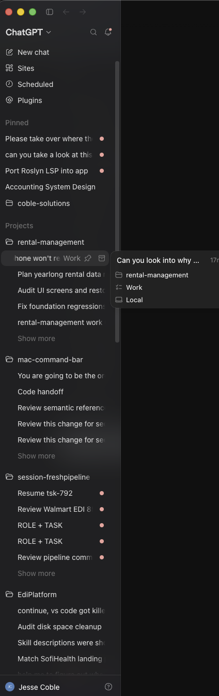

# TSK-808 Native Workbench Product Wave Implementation Plan

> For implementation agents: follow this plan one work package at a time. Use Luna Max for
> straightforward, scope-locked implementation and SOL-medium when substantial design choices or
> judgment remain. SOL-medium performs every milestone code review. Set `agent_type`, `model`,
> `reasoning_effort`, and `fork_turns: "none"` explicitly; stop before editing if an override fails.

**Goal:** Turn the existing /next shell into a legible, native-feeling workbench that joins
sessions, projects, Git, pull requests, browser feedback, resources, Markdown, run
configurations, diagnostics, and guarded agent actions without replacing the working shell or
regressing the semantic Roslyn CodeLens behavior delivered by TSK-799.

**Architecture:** Keep Svelte components as views, plain TypeScript services as imperative
orchestrators, Svelte rune stores as state-only containers, and Rust/Tauri modules as the
validated native boundary. Expand existing Dockview, session-workspace, local-Git, PTY, LSP,
and append-only orchestration abstractions. Do not add a second shell, editor, session router,
Git service, worktree manager, settings store/host, or agent runtime.

**Tech stack:** Svelte 5.56, TypeScript 6, Vite 8, Tauri 2.11, Rust, Dockview 6.6, bits-ui
2.18, Monaco plus the installed VS Code-compatible services, monaco-languageclient 10.7,
vscode-ws-jsonrpc 3.5, xterm 6, authenticated gh CLI, and focused Node/Rust tests.

**External API checks:** Browser profile constraints use the official
[Tauri Webview API](https://v2.tauri.app/reference/javascript/api/namespacewebview/);
permission/notification behavior uses the official
[Tauri Notifications guide](https://v2.tauri.app/plugin/notification/); and external HTTP/S
opening uses the official [Tauri Opener guide](https://v2.tauri.app/plugin/opener/).

**Plan authority:** Notion task TSK-808, its 19 linked rapid-fire items, its 30-image evidence
gallery, the merged TSK-799 contract, the current repository, and this file. This plan was
re-audited on 2026-08-03 against branch `tsk-799-code-intelligence` at `916c6dc`; remote
`origin/main` was `2e09399` while the local tracking ref was stale. The checkout contains 50
tracked or untracked protected-WIP paths, including TSK-799 and TSK-809/810 conversation work.
Re-run the anchor command in Work Package 0 after that WIP is released; symbols and behavior
are authoritative when a line number moves.

**2026-08-03 extension/diff checkpoint:** The user subsequently authorized the bounded
extension-compatibility experiment in this protected checkout. The work is present but remains
uncommitted/unmerged protected WIP; it is evidence to reconcile, not permission to overwrite the
checkout or declare TSK-808 complete. The checkpoint implemented the official Houston theme as a
declarative contribution, a singleton curated extension registry, a read-only VS Code SCM
projection over the existing Rust Git state, bounded original/modified Git text models, and a
native Monaco DiffEditor. The same singleton now also registers pinned VS Code declarative
language packs for the repository's common languages plus the official Svelte grammar,
configuration, and snippets. The existing workspace LSP registry was retained for semantic
navigation; pinned TypeScript and Svelte servers now resolve from the application dependencies,
including the corrected official Svelte executable name, `svelteserver`. It also produced
`tauri-svelte-preview/output/extension-integration-review.html` and
`tauri-svelte-preview/output/extension-integration-results.html`. Focused TypeScript/Rust checks,
the production bundle, and browser-preview interaction passed; native Tauri visual acceptance,
the complete extension API matrix, SCM mutations, VSIX lifecycle/security, and TSK-808 task
closure remain open.

**Path convention:** Repository-relative paths are used throughout. Within a work package,
unprefixed `shell/...`, `components/...`, `stacks/...`, `problems/...`, and `explorer/...` paths
mean `tauri-svelte-preview/src/lib/shell/...`; unprefixed `scripts/...` means
`tauri-svelte-preview/scripts/...`. Rust paths are always written from the repository root.
Every dispatch expands shorthand into absolute or repository-relative exact file paths.

---

## 1. Decision summary

1. The first bounded extension/API checkpoint has run in the protected WIP and the user selected
   the product direction: use declarative contributions such as Houston whole; use Monaco/VS Code
   APIs such as DiffEditor and SCM over existing services; do not embed Git Graph; and do not make
   GitLens a dependency of the current workbench. Reconcile this checkpoint before broad TSK-808
   work. Contrast remains the first broad product UI milestone, not polish. No other UI lane may
   invent local text, border, status, focus, or action-button colors before the contrast tokens
   and shared primitives land.
2. The present TSK-799 checkout is protected WIP. TSK-808 implementation begins only from a
   clean integration worktree based on refreshed origin/main, after the current owner has
   committed, merged, or explicitly handed off every overlapping path.
3. Already-shipped rapid-fire items are verified and closed, not rebuilt. The Notion ledger is
   stale for several tasks; Work Package 0 determines the exact disposition using tests and a
   real Tauri pass.
4. Wave 1 freezes shared contracts. In Wave 2, Luna Max implements straightforward, scope-locked
   work and may also perform discovery, audits, and preparation. SOL-medium implements work with
   substantial unresolved choices or design judgment and performs milestone code reviews. Only
   the controller edits shared seams after agents return.
5. Browser, hosted GitHub, resource control, filesystem mutation, and integrated-agent actions
   all use capability-gated native boundaries. Remote mutations and destructive local actions
   require explicit preview and confirmation.
6. Compatible extensions are a product capability, not a rejected architecture. Reuse the
   installed local web-worker extension host for capability-reviewed browser extensions and
   declarative contributions; defer unsupported Node/remote host classes until separately
   proven and approved.
7. The Settings screen that was previously available is now reported missing in the real app.
   Restore the existing surface and its reachability as part of the sequential shell foundation;
   do not create a third Settings component, a second settings store, or a replacement settings
   schema. Source presence, a successful dynamic import in a unit test, or browser-preview proof
   does not close this regression; it must be opened and exercised in a rebuilt Tauri app.
8. A 2026-08-03 native screenshot shows a CodeLens Peek state where the editor content and side
   panes remain visible, but the expected center editor tab strip/top tab controls are not visible.
   Treat this as a Peek layout regression until native reproduction proves the narrower root cause:
   Peek may resize or split the editor content, but it must not replace, hide, clip, or cover the
   workbench tab strip, active file identity, or top-bar destination controls.
9. Git graph is a native product surface, not an embedded Git Graph or GitLens view. Rust and the
   existing Git service remain the repository/history authority; a Svelte/Dockview center panel
   renders their commit/parent/ref data and opens the existing Monaco DiffEditor. A later graph
   rendering library may replace only the visual lane-layout layer after license, bundle, and
   accessibility review.

## 2. Non-negotiable execution contract

### 2.1 Exact native-agent routing gate

Classify each lane before dispatch:

- **Luna Max:** straightforward implementation whose files, behavior, interfaces, and acceptance
  are already decided; also discovery, audits, and bounded preparation.
- **SOL-medium:** implementation that still requires meaningful design/tradeoff decisions, plus
  every milestone code review.

Straightforward implementation dispatches use:

    spawn_agent({
      agent_type: "default",
      fork_turns: "none",
      model: "gpt-5.6-luna",
      reasoning_effort: "max",
      task_name: "tsk_808_straightforward_lane",
      message: "Implement only the fully specified, scope-locked lane. Stop on a design choice."
    })

High-judgment implementation dispatches use:

    spawn_agent({
      agent_type: "default",
      fork_turns: "none",
      model: "gpt-5.6-sol",
      reasoning_effort: "medium",
      task_name: "tsk_808_high_judgment_lane",
      message: "Implement the specified lane and resolve the named design decisions only."
    })

Milestone code-review dispatches also use explicit `gpt-5.6-sol` plus `medium`, with a read-only
review prompt and no implementation authority. The `default` role is intentional where installed
specialist roles have fixed model contracts that cannot prove the required model/effort pairing.
Every prompt must name exact owned files, forbidden shared files, acceptance commands, and stop
conditions. It must also contain this data rule verbatim:

    All SQL aggregation, grouping, filtering, joins, sorting, and paging run server-side
    (DB-side) as an ORM/EF-translated query that becomes ONE SQL statement, or a database view.
    NEVER do in-memory grouping/aggregation: do not materialize rows and then GroupBy, Sum,
    Count, or Where in code; do not load-then-loop, use N+1 or per-row follow-up queries, or use
    lazy loading. A roughly 20-row list page must use 1-3 DB queries total, not dozens. Confirm
    that the query translates to SQL by inspecting the generated statement; if it would run in
    memory, rewrite it DB-side or add a view plus covering index. When one instance is fixed,
    sweep the codebase for siblings.

Most lanes do not use SQL. They must still state “No database is touched in this lane” rather
than silently omitting the rule.

The same prompt must say:

    You are not alone in the codebase. Edit only the owned files. Do not revert or overwrite
    another lane's work. Do not start a heavy build or test until the controller assigns one of
    the at-most-two heavy-runner slots; the default schedule uses one. Use focused tests only;
    the controller owns the serialized integration build. Set
    MSBUILDDISABLENODEREUSE=1 for dotnet commands, RUST_TEST_THREADS=1 for Rust tests, run
    dotnet build-server shutdown after a heavy batch, and clean task-owned build artifacts and
    task-owned build artifacts before returning. The controller owns the shared integration
    worktree; report Worktree cleanup: not applicable and do not remove it.

If the routed model or effort selection is unavailable, rejected, or silently downgraded, that
implementation or milestone-review lane does not start. Planning and read-only discovery may
continue. The current stable orchestrator can explicitly select Luna Max but does not expose a
per-agent Fast service-tier field; this plan does not pretend Fast was selected.

Read-only Luna audit dispatches use:

    spawn_agent({
      agent_type: "default",
      fork_turns: "none",
      model: "gpt-5.6-luna",
      reasoning_effort: "max",
      task_name: "tsk_808_read_only_audit",
      message: "Inspect only. Do not edit, build, test, browse, create a worktree, or mutate Notion."
    })

### 2.2 Worktree and dirty-WIP contract

Current protected checkout:

- Path: /Users/blackcolours/dev/work/mac-command-bar
- Branch: tsk-799-code-intelligence
- HEAD: 916c6dcacfa458cbec9cda09113eb06d72d1fe4e
- State: 50 tracked and untracked protected-WIP paths, including package manifests,
  Cargo manifests, main.rs, lsp.rs, Monaco/editor files, shellPanels.ts, tauriSource.ts,
  the legacy route, TSK-809/810 conversation files, output, .codex, and .vscode.

Do not stash, reset, stage, rewrite, delete, or build over that state. After its owner releases
it:

    git fetch origin
    git worktree add \
      /Users/blackcolours/dev/work/worktrees/mac-command-bar/tsk-808-native-workbench \
      -b tsk-808-native-workbench-product-wave origin/main

Use one controller-owned integration worktree to save disk. File-independent agents may share
that worktree only under the ownership table in section 5. Before every dispatch, the controller
records the starting SHA and path-scoped status; after return it attributes only the exact owned
path diff. Agents do not run Git commands and never remove the shared worktree. The controller
commits owned paths per work package. Remove the worktree immediately after its branch is
pushed to a PR, merged, or abandoned:

    git worktree remove /Users/blackcolours/dev/work/worktrees/mac-command-bar/tsk-808-native-workbench
    git worktree prune

Never remove it while dirty or unmerged. In that case report its path, branch, git
status --short, and the named owner of the next action.

### 2.3 Build, browser, and native-process limits

- At most two heavy build/test runners may be active; this plan defaults to one and the
  controller alone assigns a second non-overlapping slot.
- Node focused tests may run lane-by-lane. pnpm build, cargo build, full cargo test, and real
  Tauri proof are controller-owned and serialized.
- Every browser verifier uses a unique name such as tsk-808-browser-proof and closes the
  daemon, Chrome/Chromium helpers, exact external tab, fixture server, and task-owned Tauri
  process before returning.
- A Tauri browser child webview is not a Playwright process. The verifier must also prove that
  all child webviews and task-owned native processes die on app exit.
- Browser-preview proof cannot close a native-desktop acceptance item.

### 2.4 Existing architecture rules

- No backend IO at module import.
- No backend IO from a Svelte $effect.
- Activation is imperative and visibility-gated through panelActivation.ts and shellPanels.ts.
- Stores hold state; services own requests, request guards, retries, and backend calls.
- New Tauri commands are capability-gated because older builds silently drop unknown payload
  keys.
- No window.confirm or window.alert. Use the existing AlertDialog and Dialog components.
- User-visible body text is at least 13px; metadata is at least 12px.
- All user-visible text is plain English.
- Remote text, GitHub comments, page content, and repository content are untrusted data.

---

## 3. Source-of-truth task coverage

### 3.1 The 19 rapid-fire items

| Task                                        | Notion state on 2026-08-01 | Repository evidence                                                                                                                                                                                                                 | Planned disposition                                                                |
| ------------------------------------------- | -------------------------- | ----------------------------------------------------------------------------------------------------------------------------------------------------------------------------------------------------------------------------------- | ---------------------------------------------------------------------------------- |
| TSK-758 Minimize panels to an edge strip    | To Do, Low                 | Sessions already collapse in SessionsColumn.svelte:540-577 and /next/+page.svelte:198-219; other regions lack one shared minimize model  | Finish in Work Package 2                                                           |
| TSK-759 Rebuild /next frame                 | To Do, High                | ShellFrame.svelte:21-155, frame.ts, and centerDock.ts:26-323 already implement the Codex-shaped shell                                                                                                                               | Verify in Work Package 0; close if native proof passes                             |
| TSK-760 Project picker and new-session flow | To Do, High                | newSessionFlow.ts, ownedSessions.ts, and /next/+page.svelte:477-563 already create/adopt/persist sessions                                                                                                                           | Verify in Work Package 0; close if proof passes                                    |
| TSK-761 Working, Done, Settled lifecycle    | Doing, Medium              | sessionCardModel.ts:42 onward distinguishes running/done/stopped; rail store has complete/reopen; richer state/notifications remain                                                                                                 | Finish in Work Package 3                                                           |
| TSK-762 Rail correctness                    | To Do, High                | SessionsColumn, openFileBus, project selection, and sessionWorkspaces are present                                                                                                                                                   | Verify in Work Package 0; defects roll into Work Package 3                         |
| TSK-763 Worktree manager                    | To Do, High                | WorktreeManagerPane, WorktreeRow, RemoveWorktreeDialog, service, and safety tests are present                                                                                                                                       | Preserve; finish shared hit targets and Git context in Work Package 6              |
| TSK-764 Playwright process card             | To Do, Medium              | PlaywrightCard, backend, service, store, per-session stop, and cleanup tests are present                                                                                                                                            | Verify and close in Work Package 0                                                 |
| TSK-765 Theme system and imports            | To Do, Medium              | Houston/Dracula registry exists; the protected 2026-08-03 checkpoint now registers the official Houston contribution once and removes the late legacy color override, but native proof, contrast migration, and generic VSIX import remain open | Reconcile Houston checkpoint; contrast in Work Package 1; optional safe theme/grammar import in Work Package 12 |
| TSK-766 CMUX orchestration research         | To Do, Medium              | core session scanner knows CMUX; append-only orchestration model exists                                                                                                                                                             | Close research decision in Work Package 0; product actions live in Work Package 11 |
| TSK-767 Stack runner                        | To Do, High                | stackStore and stackService already implement saved run configurations and terminal handlers                                                                                                                                        | Verify wiring in Work Package 4; finish only evidenced gaps                        |
| TSK-768 Format document                     | To Do, Medium              | format_source_with_lsp exists at main.rs:1009-1017; editor command wiring is absent/incomplete                                                                                                                                      | Finish in Work Package 4                                                           |
| TSK-769 DB browser                          | To Do, Low                 | No implementation; right-side tool roster can host it                                                                                                                                                                               | Keep gated until Work Package 13; no hidden SQL shortcut                           |
| TSK-770 Problems panel                      | To Do, Medium              | LSP diagnostics exist in problemsService.ts:63-179; build-output ingestion is absent                                                                                                                                                | Finish in Work Package 4                                                           |
| TSK-771 Prefilter before 512-file budget    | To Do, Medium              | core sessions scanner has bounded prefilter at sessions.rs:900-982                                                                                                                                                                  | Verify and close in Work Package 0                                                 |
| TSK-773 Svelte type-check blind spot        | To Do, Medium              | package.json contains svelte-check and check:svelte; focused gate exists                                                                                                                                                            | Verify and close in Work Package 0                                                 |
| TSK-779 Top-bar quick open                  | To Do, Medium              | ShellFrame exposes showCenterPanel at lines 116-125; top bar does not surface the three primary destinations                                                                                                                        | Finish in Work Package 2                                                           |
| TSK-780 Right pane tabbed surface           | To Do, Medium              | ShellSidebar/sidebarViews and Dockview tools exist; roster needs extension-safe contract                                                                                                                                            | Verify base and freeze roster contract in Work Package 2                           |
| TSK-783 Editor paints text instantly        | To Do, High                | EditorPanel waits for Monaco and displays “Starting the code editor” at lines 659-683                                                                                                                                             | Finish in Work Package 4                                                           |
| TSK-784 Language-server status              | To Do, Medium              | Dirty TSK-799 WIP contains LanguageServerStatusChip at EditorPanel lines 637-642                                                                                                                                                    | Reconcile against merged PR#13, verify, then close or finish in Work Package 4     |

### 3.1b Immediate /next regressions (post-WIP parity)

| Task                         | Notion state | Repository evidence                                                                                                             | Disposition                                                                                       |
| ---------------------------  | ------------  | ---------------------------------------------------------------------------------------------------------------------------- | ------------------------------------------------------------------------------------------------ |
| Settings screen reachability  | In TSK-808 scope | ShellOverlays mounts `SettingsHost` and exposes `openSettings`; check that `onOpenSettings` in `ActivityBar` opens `SettingsHost` -> `SettingsDialog` in native build. [ShellOverlays](/Users/blackcolours/dev/work/mac-command-bar/tauri-svelte-preview/src/lib/shell/components/ShellOverlays.svelte:1), [SettingsHost](/Users/blackcolours/dev/work/mac-command-bar/tauri-svelte-preview/src/lib/shell/components/SettingsHost.svelte:1), [SettingsDialog](/Users/blackcolours/dev/work/mac-command-bar/tauri-svelte-preview/src/lib/shell/components/SettingsDialog.svelte:11), [ActivityBar](/Users/blackcolours/dev/work/mac-command-bar/tauri-svelte-preview/src/lib/shell/components/ActivityBar.svelte:1), [/next activity/settings wiring](/Users/blackcolours/dev/work/mac-command-bar/tauri-svelte-preview/src/routes/next/+page.svelte:996), [/next overlay mount](/Users/blackcolours/dev/work/mac-command-bar/tauri-svelte-preview/src/routes/next/+page.svelte:1098) | Restore by proving gear-opened settings open in a rebuilt Tauri run; capture a 2-second screencapture before closing the lane. |
| CodeLens Peek hides editor tabs | In TSK-808 scope | Native path uses `roslyn.client.peekReferences` and command `editor.action.showReferences` in `csharpLanguageClient.ts`; browser fallback uses `editor.action.peekLocations` in `MonacoSourceEditor.svelte`; `/next` owns separate center-destination and open-file tab strips. [csharpLanguageClient](/Users/blackcolours/dev/work/mac-command-bar/tauri-svelte-preview/src/lib/shell/editor/csharpLanguageClient.ts:319), [Monaco fallback](/Users/blackcolours/dev/work/mac-command-bar/tauri-svelte-preview/src/lib/MonacoSourceEditor.svelte:2158), [file tabs](/Users/blackcolours/dev/work/mac-command-bar/tauri-svelte-preview/src/lib/shell/components/EditorPanel.svelte:626), [center tabs](/Users/blackcolours/dev/work/mac-command-bar/tauri-svelte-preview/src/lib/shell/components/ShellFrame.svelte:198) | Reproduce and close in rebuilt Tauri: populated Peek must leave both tab layers and the future top-bar destination switch visible and usable. Prove before/after plus a short recording. Browser parity is useful, but browser-preview proof cannot close this native regression. |

### 3.2 Dependencies and stale states

- TSK-785, TSK-798, and TSK-799 are Done and are dependencies, not reopened work.
- TSK-809 and TSK-810 are separate open conversation-workbench tasks. They own composer/model/
  attachment controls, the canonical conversation runtime/store, child-agent hierarchy, and
  transcript inspection. TSK-808 owns deterministic workbench context, capability-gated action
  proposals, and their audit receipts. It must reuse the TSK-809/810 contracts after merge or
  defer its chat UI; it must not create a second conversation store, provider host, composer,
  child tree, or transcript pane.
- TSK-789 is still Doing in Notion even though TSK-799 absorbed its remaining queue,
  cancellation, and CodeLens lifecycle scope. Work Package 0 verifies the merged behavior and
  closes TSK-789 if nothing remains.
- TSK-307, TSK-312, TSK-315, TSK-344, and other older task records overlap individual
  components. TSK-808 must not silently close them. Work Package 0 links evidence and asks
  capture-task to update only when durable tracking truth changes.
- TSK-802 is a separate low-priority LSP hardening item and is not absorbed.

The Notion task and its 30 attachments are the evidence-gallery authority. Only two image files
are currently mirrored under this plan's local `image/2026-08-01-tsk-808-native-workbench-product-wave`
folder; local absence is not evidence that the remaining Notion attachments do not exist. At
execution time, record the Notion attachment reference used for each acceptance row without
copying or renumbering the gallery.

### 3.3 TSK-808 capability lanes

The epic adds seven capability lanes beyond the 19 task cleanup:

1. Sessions, navigation, status, and notifications.
2. Local Git, graph, diffs, files, and worktrees.
3. Hosted pull requests, reviews, checks, conflicts, and GitHub budgets.
4. Workspace-isolated browser, annotations, and native webview lifecycle.
5. Resources, provider usage, ports, disk visibility, and Roslyn ownership.
6. Rich Markdown reading/editing.
7. Guarded integrated-agent actions and an isolated web-extension-host proof.

---

## 4. Product and architecture decisions

### 4.1 Contrast and accessibility contract

Use computed contrast, not visual opinion:

- Normal text under 18pt: at least 4.5:1 against every surface on which it appears.
- Large text: at least 3:1.
- Focus rings, status dots, selected-row boundaries, dividers that are the sole boundary, and
  other meaningful non-text indicators: at least 3:1.
- Dense desktop icon actions: at least 32 by 32 CSS pixels; 36 by 36 when the row permits.
- Running and done use different hue families and always include a text label.
- Attention, approval, blocked, failed, idle, and done do not share one green.
- Every icon-only action has an accessible name and a tooltip available on hover and keyboard
  focus.
- Every interactive row has an explicit focus-visible style.
- Reduced Motion disables pulses and nonessential transitions.
- All information-bearing text uses --color-text or --color-text-2. --color-text-3 is reserved
  for disabled controls and decorative hints that repeat visible information.

These are reusable semantic tokens for every workbench surface, including portals, overlays,
tooltips, native-view placeholders, Dockview chrome, Markdown, Git, sessions, Problems, settings,
and extension UI. Components consume the semantic token instead of inventing a local shade.
The implementation must enumerate and migrate current information-bearing `--color-text-3`
uses before a broad literal-color scan is enabled.

Starting palette candidates:

| Token             |                                          Houston candidate |                   Dracula candidate | Meaning                       |
| ----------------- | ---------------------------------------------------------: | ----------------------------------: | ----------------------------- |
| --color-text      |                                                    #eef0f9 |                             #f8f8f2 | Primary text                  |
| --color-text-2    |                       Compute to pass 4.5:1; start #a7a7b5 | Compute to pass 4.5:1; start #b8b8c4 | Secondary information         |
| --color-text-3    | Compute to pass 4.5:1 when text; otherwise decorative-only |                           Same rule | No low-contrast required copy |
| --color-live      |                                                    #54b9ff |                             #8be9fd | Running/in turn               |
| --color-good      |                                                    #8bdc9b |                             #50fa7b | Completed/passing             |
| --color-attention |                                                    #ffd493 |                             #f1fa8c | Needs attention/approval      |
| --color-bad       |                                                    #ff6d91 |                             #ff5555 | Failed/blocked                |

The implementation test, not these candidate hex values, decides final colors. Ratios are
computed against every actual surface state, including hover, selected, disabled, focus,
overlay, and portal backgrounds. Hue-family assertions separately prove that running, done,
attention, and failed remain distinguishable without relying on text color alone.

### 4.2 Center and tool surfaces

Refactor ShellFrame.svelte:21-49 from a closed center object into a typed roster:

    export type CenterPanelId =
      | "session"
      | "editor"
      | "browser"
      | "diff"
      | "gitGraph"
      | "pullRequests"
      | "markdown";

    export interface CenterPanelRegistration {
      id: CenterPanelId;
      title: string;
      content: Snippet;
      group: "conversation" | "display";
      permanent: boolean;
    }

    interface ShellFrameProps {
      sessions: Snippet;
      centerPanels: CenterPanelRegistration[];
      tools: Snippet;
      activity: Snippet;
      dock: Snippet;
      onCenterPanelShown?(id: CenterPanelId): void;
      onReady?(controls: ShellFrameControls): void;
    }

Keep centerDock.ts generic. Add activePanelId() and setPanelVisible(id, visible) to CenterDock;
do not add browser-specific behavior to Dockview. Bump CENTER_LAYOUT_KEY once when the roster
changes, not once per lane.

### 4.3 State and IO boundaries

Every new capability uses this flow:

    Svelte component
        -> state-only rune store
        -> imperative TypeScript service with request generation/guards
        -> typed backend adapter
        -> capability-gated Tauri command
        -> validated Rust module

Event flows return through one typed listener adapter and carry stable identity plus a request
or generation number. Stale root, workspace, tab, file, PR, or session events are discarded.

### 4.4 Deterministic facts and agent summaries

The integrated agent never becomes the source of truth for:

- Git status, branch, dirty state, ahead/behind, or worktree safety.
- Pull-request state, checks, review threads, mergeability, or rate budgets.
- Process ownership, CPU/RSS, ports, or LSP process identity.
- Session state, terminal exit code, run-configuration state, or notification eligibility.

Those facts come from deterministic services. The LLM may summarize them into short prose and
prepare a proposed action. The proposal is appended to the orchestration log; the native
boundary revalidates facts before any mutation.

### 4.5 Explicitly rejected or deferred architectures

- No Code OSS or Theia embedding.
- Do not reject extensions. Reuse the installed `vscode/localExtensionHost` and emitted
  `extensionHost.worker` for capability-reviewed, browser-compatible extensions and declarative
  theme/grammar/icon contributions.
- The exact Houston theme JSON is an approved declarative contribution. Register it once before
  `MonacoVscodeApiWrapper.start`, exclude Houston's activation/webview extras, and let the theme
  own workbench, TextMate, and semantic-token colors. Do not layer the old hand-authored Monaco
  approximation over it; that caused the visible Houston-then-old-theme repaint.
- Do not embed the Git Graph extension. It has no compatible browser entry for the present
  LocalWebWorker host, assumes a desktop/workspace Node and Git environment, and is not the
  repository authority this product needs. Implement the graph described in Work Package 5 over
  the existing Rust Git model. Treat its product behavior as inspiration, not reusable shipped
  extension code.
- Do not make GitLens part of the current product baseline. Its browser entry proves only that
  activation in a web extension host is possible; its valuable views still depend on a larger VS
  Code workbench/view/storage/repository-provider/auth surface than the current editor-service
  host exposes. Reconsider it only through a separately approved full-workbench compatibility
  spike with measured startup, memory, bundle, and adapter cost.
- A Node/local-process host, remote extension host, or automatic marketplace download is not
  categorically rejected; it is deferred until a separate security, resource, and distribution
  decision proves that host class. It is not silently introduced by the LocalWebWorker lane.
- A user-selected VSIX may be staged and enabled when its manifest and browser entrypoint pass
  the Work Package 12 policy. Unsupported native/process capabilities are rejected with an
  explanation rather than treating every extension package as forbidden.
- No iframe-based claim of a full browser.
- No shared cookie jar across workspaces.
- No frontend-held GitHub token.
- No shell-built gh or git command.
- No process-name-based kill.
- No repository-wide worktree prune for a single row.
- No general eval command into a browser child webview.
- No Markdown HTML injection without a sanitizer.
- No duplicate Roslyn owner or independent frontend/backend LRU policies.

---

## 5. Lane ownership and merge order

### 5.1 Controller-owned shared seams

Only the controller edits these after Wave 1:

- tauri-svelte-preview/package.json and pnpm-lock.yaml
- tauri-svelte-preview/src-tauri/Cargo.toml and Cargo.lock
- tauri-svelte-preview/src-tauri/src/main.rs
- tauri-svelte-preview/src/lib/tauriSource.ts
- tauri-svelte-preview/src/routes/next/+page.svelte
- tauri-svelte-preview/src/lib/shell/components/ShellFrame.svelte
- tauri-svelte-preview/src/lib/shell/layout/centerDock.ts
- tauri-svelte-preview/src/lib/shell/layout/layoutStorage.ts
- tauri-svelte-preview/src/lib/shell/panelActivation.ts
- tauri-svelte-preview/src/lib/shell/shellPanels.ts
- tauri-svelte-preview/src/lib/shell/shellCommands.ts
- tauri-svelte-preview/src/lib/settingsStore.svelte.ts
- tauri-svelte-preview/src/lib/shell/components/ActivityBar.svelte
- tauri-svelte-preview/src/lib/shell/components/SettingsDialog.svelte
- tauri-svelte-preview/src/lib/shell/components/SettingsHost.svelte
- tauri-svelte-preview/src/lib/shell/components/ShellOverlays.svelte
- tauri-svelte-preview/src/lib/shell/components/PalettePanel.svelte
- tauri-svelte-preview/src-tauri/capabilities/default.json

Agents that need a shared-seam change write an integration receipt containing the exact
symbol, insertion point, imports, registration line, capability name, and test. The controller
applies all receipts in one serialized integration step.

### 5.2 File-independent implementation lanes

| Lane                     | Agent-owned paths after contracts freeze                                                               | Heavy work                   |
| ------------------------ | ------------------------------------------------------------------------------------------------------ | ---------------------------- |
| A Contrast/primitives    | styles/nextTokens.css, styles/themeChrome.css, themes/themeRegistry.ts, components/shared, token tests | Node only                    |
| B Sessions/notifications | components/SessionsColumn.svelte, components/sessions, stores/sessionRailStore, notifications          | Node only                    |
| C Editor/run/problems    | stacks, problems, editor helper modules, new editor components; EditorPanel only after TSK-799 release | Node focused                 |
| D Git/files/worktrees    | shell/git, components/git, explorer, components/explorer, worktree presentation, `src-tauri/src/git_diff_models.rs`, `src-tauri/src/workspace_entries.rs`, `src-tauri/src/workspace_file_watch.rs` | Node plus focused Rust       |
| E Hosted GitHub          | new shell/github, components/github, `src-tauri/src/github.rs`                                         | One focused Rust lane        |
| F Browser                | shell/browser, components/browser, `src-tauri/src/browser.rs`, and `src-tauri/src/browser_inspector.js` | One focused Rust lane        |
| G Resources/Roslyn       | new resources modules, `core/src/scanners/resources.rs`, provider usage; `lsp.rs` only after TSK-799 release | One focused Rust lane        |
| H Markdown               | sourceMarkdownPreview.ts, SourceMarkdownPreview.svelte, new shell/markdown, Markdown tests             | Node only                    |
| I Integrated agent       | new shell/agent fact/action helpers and action preview only; existing conversation files remain TSK-809/810-owned | Node focused                 |
| J Curated extensions     | existing `shell/extensions`, Houston asset/license, compatibility tests/reports; `csharpLanguageClient.ts` only after editor work. Add `src-tauri/src/vsix_import.rs`, a generic broker, or executable fixtures only after a new explicit package selection | Node now; focused Rust/native proof only if VSIX graduation is resumed |

No more than two Rust lanes run tests at the same time; the default is one. Lanes B, D, H, and
I may run in parallel only after Lane A and Work Package 2 contracts land. Every dispatch
expands these directory summaries into an exact path allow-list and records the starting
path-scoped diff; a directory-level row alone is not edit authority.

### 5.3 Planned commit order

1. plan: record TSK-808 native-workbench execution contract
2. spike: reconcile the implemented extension/API checkpoint and its reports; selection is
   Houston contribution + native DiffEditor + SCM adapter, with GitLens/Git Graph embedding out
3. feat: establish accessible workbench tokens and shared controls
4. fix: restore Settings reachability and freeze typed shell panel/action contracts
5. feat: finish sessions, lifecycle, and notifications
6. feat: finish editor, run configurations, format, and problems
7. feat: add full Git graph and safe workspace explorer
8. feat: add guarded hosted pull-request workflows
9. feat: add workspace-isolated native browser
10. feat: add resource ownership and Roslyn lifecycle controls
11. feat: replace Markdown preview with safe rich workbench
12. feat: add guarded integrated-agent actions
13. feat: enable the user-selected compatible extension/API paths
14. test: certify TSK-808 in the native desktop app

Each commit contains only its owned paths plus the controller wiring required for that lane.

---

## 6. Work Package 0 — reconcile WIP, verify shipped tasks, and re-anchor

**Purpose:** Do not rebuild features that are already present, and do not overwrite the
uncommitted CodeLens/Roslyn work.

**Owner:** Controller. Read-only until the current TSK-799 owner releases the checkout.

### Current anchors to inventory

- TSK-799 merge: PR #13, merged commit `2e09399`; current checkout HEAD `916c6dc` is one local
  docs commit ahead of its remote branch and has 50 additional protected dirty/untracked paths.
- Existing shell: ShellFrame.svelte:21-155, centerDock.ts:26-323, frame.ts.
- New-session flow: newSessionFlow.ts:24-200, ownedSessions.ts:13-106,
  /next/+page.svelte:477-563.
- Session workspace flow: sessionWorkspaces.ts:26-53 and 340 onward,
  /next/+page.svelte:377-473.
- Playwright cleanup: processes/playwrightBackend.ts:31-79,
  processes/playwrightService.ts:60-145, PlaywrightCard.svelte.
- Scanner prefilter: core/src/scanners/sessions.rs:900-982.
- Svelte gate: package.json scripts check and check:svelte.
- Run configurations: stacks/stackService.ts:61-293 and stackStore.svelte.ts.
- Problems: problemsService.ts:63-179.
- Language status: dirty EditorPanel.svelte:637-642.

### Steps

1. Capture the current lease:

   git branch --show-current
   git rev-parse HEAD
   git status --short
   git diff --name-only
   git ls-files --others --exclude-standard
   git worktree list --porcelain

   Save the output in the execution log, not in this plan. Ask the current owner to classify
   each dirty path as committed/merged, keep, discard, or still active. No controller guess.
   A discard classification is not deletion authority: obtain the user’s explicit approval
   before removing, reverting, or overwriting any current dirty or untracked content.
2. Compare merged origin/main and the dirty checkout:

   git fetch origin
   git diff --name-status origin/main...HEAD
   git diff --name-status origin/main

   Read-only comparison is allowed. Do not merge, stash, or reset.
3. Once released, create the clean TSK-808 worktree from origin/main. Record:

   git rev-parse HEAD
   git status --short
   git worktree list --porcelain
4. Re-anchor every symbol used below. Treat all line references after this section as the
   2026-08-03 audit snapshot until this command is rerun:

   rg -n "createCenterDock|interface Props|activatePanel|registerCommands" tauri-svelte-preview/src/lib/shell
   rg -n "format_source_with_lsp|read_git_commit_history|remove_project_worktree" tauri-svelte-preview/src-tauri/src
   rg -n "SourceLspRegistry|ensure_native_csharp_endpoint|stop_server" tauri-svelte-preview/src-tauri/src/lsp.rs

   Update only moved line references in this file; do not change scope during re-anchoring.
5. Run the existing focused tests for candidate shipped tasks, serially:

   cd tauri-svelte-preview
   pnpm test:new-session-flow
   pnpm test:owned-sessions
   pnpm test:session-workspaces
   pnpm test:session-scan-filter
   pnpm test:playwright-store
   pnpm test:stack-store
   pnpm test:problems-store
   pnpm test:language-server-status
   pnpm check:svelte
   pnpm check
6. Run one real-Tauri audit for TSK-759, 760, 762, 764, 767, 771, 773, and 784. Evidence must
   show cold launch, project pick, new session, session switch with exact workspace restore,
   file click into Editor, Playwright card status and stop flow in a disposable named session,
   Run configuration start/exit state, and language-server status.
7. Read TSK-808 directly and null-safely before relying on project-list output. The current
   `list-tasks.sh` helper can fail on a malformed TSK-795 row with null status/title. If TSK-808's
   status cannot be read directly, stop; never infer that the task is open. Update Notion only
   from evidence:

   - Close a task that is wholly shipped and verified.
   - Keep a task open when a named acceptance behavior still fails.
   - Add a short link from a stale absorbed task to TSK-808 or TSK-799 before closing it.
   - Do not reopen Done tasks.

### Stop conditions

- Stop before implementation if TSK-799 ownership is not released.
- Stop if origin/main does not contain PR #13; resolve branch authority first.
- Stop if the Notion status of TSK-808 is Done/closed.
- Stop if a planned shared file is dirty in the new worktree.

### Done

- Clean TSK-808 worktree exists at the mandated path.
- Each of the 19 tasks has one disposition: closed with evidence, active in a named work
  package, or explicitly retained as later scope.
- Current line anchors and collision table are recorded.
- No current user WIP was changed.

---

## 7. Work Package 1 — contrast-first theme foundation

**Covers:** TSK-765 contrast and theme correctness; the user’s primary usability blocker.

**Dependencies:** Work Package 0 complete. This package lands before every other UI package.

**Owner paths:**

- Modify src/lib/shell/styles/nextTokens.css:41-122.
- Modify src/lib/shell/styles/themeChrome.css.
- Modify src/lib/shell/themes/themeRegistry.ts:81-143 and both theme token maps.
- Modify src/routes/next/+page.svelte:1122-1123 only through a controller integration
  receipt; replace hard-coded Houston colors.
- Create src/lib/shell/themes/contrast.ts.
- Create scripts/contrastTokens.test.mjs.
- Modify scripts/themeRegistry.test.mjs.
- Modify scripts/nextTokens.test.mjs.

### Exact code

Create pure helpers in contrast.ts:

    export type Rgb = { red: number; green: number; blue: number; alpha: number };

    export function parseCssColor(value: string, backdrop?: Rgb): Rgb;
    export function composite(foreground: Rgb, backdrop: Rgb): Rgb;
    export function relativeLuminance(color: Rgb): number;
    export function contrastRatio(foreground: Rgb, background: Rgb): number;
    export function assertContrast(
      foreground: string,
      background: string,
      minimum: number,
      label: string
    ): void;

The parser supports only the formats used by the registry: 3/6/8-digit hex and rgb/rgba.
Reject unknown formats in tests instead of treating them as black.

Change the theme token contract:

- Add --color-selected, --color-selected-border, --color-hover,
  --color-focus-solid, --color-disabled-text, and --color-status-idle.
- Keep --color-focus as the translucent shadow color, but pair it with a solid
  --color-focus-solid for the 3:1 focus boundary.
- Keep --color-live for live/in-turn and --color-good for done/passing. They must never match.
- Point all information-bearing tertiary uses to --color-text-2. Rename no existing token in
  this wave; compatibility matters more than a clean token vocabulary.
- Replace .next-shell route hard-codes with background: var(--color-bg) and
  color: var(--color-text).

Add a token-use audit to contrastTokens.test.mjs:

1. Parse nextTokens.css and every theme in themeRegistry.ts.
2. Assert TOKEN_NAMES is complete for every theme.
3. Test --color-text and --color-text-2 against bg, surface, elevated, selected, and hover.
4. Test focus-solid, selected-border, border when it is a sole boundary, and all status tones
   against their actual backgrounds at 3:1.
5. Assert live and good values differ and have a perceptible hue separation.
6. Scan the files changed by TSK-808 for new raw color literals. A full-tree scan requires an
   explicit baseline allow-list because existing overlays, palette, conversation, Monaco, and
   xterm surfaces contain intentional or pre-existing literals; do not make unrelated WIP fail.
7. Scan for information-bearing font sizes below 12px and fail with file and line.

### UI audit

Audit these first because current evidence shows low contrast:

- SessionsColumn.svelte:583-586, 630-642, 663, 676-715, and row metadata.
- top-level `src/lib/SourceMarkdownPreview.svelte`:58-75, where metadata is currently 10px and
  #8f9996.
- ShellFrame Dockview token mapping at lines 190-218.
- Activity bar, context cards, Git rows, worktree chips, editor status line, Problems metadata,
  run-configuration metadata, and Settings descriptions.

Do not make every surface equally bright. Preserve hierarchy with weight, spacing, surface
depth, and primary versus secondary tokens; do not use unreadable opacity.

### Tests and proof

    cd tauri-svelte-preview
    node --experimental-strip-types scripts/contrastTokens.test.mjs
    pnpm test:next-tokens
    pnpm test:theme-registry
    pnpm check:svelte
    pnpm check

Native visual proof must include matching Houston and Dracula screenshots at:

- 1440 by 900 normal window.
- Narrow window with sessions expanded.
- Settings dialog and portaled menu.
- Git rows, Problems rows, session rows, editor status, and disabled actions.
- Keyboard focus on a row and icon action.

### Done

- Automated ratios pass.
- No required text uses --color-text-3 or opacity to fall below 4.5:1.
- Running and done are distinguishable by color and word.
- The /next root no longer bypasses theme tokens.
- The user can read subtext without selecting or hovering it.

---

## 8. Work Package 2 — shared controls, shell roster, quick open, and edge minimization

**Covers:** TSK-758, TSK-779, TSK-780, the TSK-808 missing-Settings regression, and shared
contracts required by every later lane.

**Dependencies:** Work Package 1.

### 8.1 Shared action primitives

Create:

- src/lib/shell/components/shared/ShellIconButton.svelte
- src/lib/shell/components/shared/ShellStatusBadge.svelte
- src/lib/shell/components/shared/ShellToolbar.svelte
- src/lib/shell/components/shared/ShellEdgeStrip.svelte
- scripts/shellPrimitives.test.mjs

ShellIconButton props:

    interface Props {
      icon: Component;
      label: string;
      tooltip?: string;
      tone?: "neutral" | "danger";
      size?: "dense" | "regular";
      disabled?: boolean;
      pressed?: boolean;
      shortcut?: string;
      onclick?: (event: MouseEvent) => void;
    }

Behavior:

- dense is 32 by 32; regular is 36 by 36; glyphs remain 14–16px.
- Real button disabled semantics; no click handler when disabled.
- aria-label always uses label; aria-pressed only when pressed is defined.
- Tooltip opens on pointer hover and keyboard focus and includes shortcut when present.
- focus-visible uses --color-focus-solid plus the focus shadow token.

ShellStatusBadge props:

    type ShellStatusTone =
      | "live"
      | "good"
      | "attention"
      | "bad"
      | "idle"
      | "neutral";

    interface Props {
      label: string;
      tone: ShellStatusTone;
      detail?: string;
      pulse?: boolean;
    }

The component renders label text and an aria-hidden dot. Pulse is ignored under Reduced
Motion. It never communicates through color alone.

### 8.2 Typed center roster

Modify ShellFrame.svelte:25-164 and centerDock.ts:26-73, 85-175, 298-333:

1. Evolve the current `CenterPanelSpec[]` contract into `CenterPanelRegistration[]`; do not add
   a competing roster type. Replace the four fixed bound slot variables with a
   Map<CenterPanelId, HTMLElement>.
2. The parking stage creates one host for each registration. The implementation may use a
   keyed Svelte each block; it must preserve Svelte ownership during Dockview moves.
3. CenterDock.activatePanel accepts CenterPanelId.
4. Add activePanelId(): CenterPanelId | null.
5. Add setPanelVisible(id, visible). Hidden panels return to parking and are not immediately
   re-added by the permanent-roster guard; restoring them reuses the same element.
6. Keep onPanelActivated startup suppression in panelActivation; no capability loads at
   initial Dockview construction.
7. Change close behavior from “every roster tab is permanent” to per-registration permanent.
8. Add roster version to layoutStorage.ts. Bump once to include gitGraph, pullRequests, and
   markdown.
9. Preserve the dirty TSK-799 `CenterDockSnapshot` capture/restore and existing conversation/
   browser workspace restoration. Migrate old snapshot IDs and per-registration permanent
   policy explicitly; do not discard saved layouts or re-add hidden panels through the current
   permanent-roster guard.

Tests:

- Existing source-dock/layout tests remain green.
- A hidden panel has no Dockview panel and its Svelte content remains parked.
- Restore uses the same element.
- activePanelId follows user selection.
- Stored layouts with the old panel set fall back once and persist the new roster.
- No panel activation causes backend IO before allowSessionLoads.

### 8.3 Top-bar quick open

Create `src/lib/shell/components/TopBarDestinationSwitch.svelte` as the three-button destination
switch. Do not create another command palette or file/symbol quick-open overlay: reuse the
existing `PalettePanel.svelte`, `shell/palette/commandRegistry.ts`, and top-level
`components/overlays/QuickOpenOverlay.svelte` for Cmd/Ctrl+K and Cmd/Ctrl+Shift+P flows.

Props:

    interface Props {
      active: CenterPanelId | null;
      open(panel: "session" | "editor" | "browser"): void;
    }

Render three labelled 32px buttons: Session, Editor, Browser. Use the shared primitive, show
selected state, and expose shortcuts:

- Cmd+1 Session
- Cmd+2 Editor
- Cmd+3 Browser

Modify shellCommands.ts and commandRegistry.ts only through controller integration:

- show-session
- show-editor
- show-browser

Mount TopBarDestinationSwitch in `/next/+page.svelte` near the current top bar around 1046 and
call the existing
showCenterPanel control. Do not create a second navigation store.

### 8.4 Edge minimization

Create src/lib/shell/layout/shellMinimizeState.ts:

    export type MinimizedRegion = "sessions" | "tools" | "dock";

    export interface ShellMinimizeSnapshot {
      sessions: boolean;
      tools: boolean;
      dock: boolean;
      lastToolView: SidebarViewId;
    }

    export const SHELL_MINIMIZE_STORAGE_KEY =
      "mac-command-bar.next.shell-minimize.v1";

    export function readShellMinimizeSnapshot(storage: LayoutStorage): ShellMinimizeSnapshot;
    export function writeShellMinimizeSnapshot(
      storage: LayoutStorage,
      snapshot: ShellMinimizeSnapshot
    ): boolean;
    export function toggleRegion(
      snapshot: ShellMinimizeSnapshot,
      region: MinimizedRegion
    ): ShellMinimizeSnapshot;

ShellEdgeStrip renders only the minimized region’s labelled restore button. It must not
destroy the region’s component or service state. The controller maps state to frame controls:

- sessions: existing collapsed width and existing SessionsColumn collapsed strip.
- tools: width equals the activity strip only; keep the selected tool view parked.
- dock: height equals a 32px edge strip rather than zero.

Restore the last nonzero dimensions from the frame before minimization. If no measured value
exists, use the frame defaults. Persist only after a real measured layout.

### 8.5 Restore and certify the existing Settings screen

**Reported regression:** The user previously had a Settings screen and can no longer see or
reach it. Treat this as a native product regression to reproduce, not as evidence that Settings
must be designed from scratch. The 2026-08-03 dirty snapshot already contains two deliberate
route-specific views over one canonical store:

- The legacy route imports `src/lib/SettingsPanel.svelte` at `/routes/+page.svelte:2`, owns
  `settingsOpen` at line 739, toggles it from the gear at lines 14985-14990, and mounts
  `<SettingsPanel bind:open={settingsOpen} />` at line 16530. Freeze this route except for a
  shared-component compatibility repair proven necessary by a regression test.
- The `/next` route imports `ActivityBar`, `ShellOverlays`, and the canonical `settings` store at
  `/routes/next/+page.svelte:25-40`; the activity snippet calls `overlays?.openSettings()` at
  lines 996-1001; and the single `ShellOverlays` instance is mounted at lines 1098-1106.
- `ActivityBar.svelte:58-86` renders the Settings gear and calls `onOpenSettings`.
- `ShellOverlays.svelte:46-70` forwards both the gear and palette command to one
  `SettingsHost` instance.
- `SettingsHost.svelte:45-100` owns the open flag, lazy-loads `SettingsDialog.svelte`, and
  exposes a visible load-failure path.
- `PalettePanel.svelte:136-160` already registers exactly one `open-settings` command.
- `SettingsDialog.svelte:20-477` renders Appearance, Editor, Terminal, and General tabs plus
  Problems placement and C# language-server controls from `settingsStore.svelte.ts`.
- `settingsStore.svelte.ts:21-125, 130-188, 197-252` is the only settings schema/default/load/
  persist/update/reset authority, using `mac-command-bar.settings`.

Do not mistake the present controls for completed behavior. The current audit found that editor
ligatures and terminal cursor blink are page-local toggles, `/next` persists `terminal.theme`
without a proven xterm consumer, and the legacy route has a separate `sourceTerminalApp` state/
storage path alongside `settings.general.terminalApp`. The C# adapter also needs an explicit
rollback contract for unsupported, thrown, and response-state-mismatch cases. These are acceptance
gaps to reconcile, not permission to replace TSK-799's dirty Roslyn lifecycle work.

Work Package 0 must refresh these line anchors after protected WIP is released. It must also
record the exact failure class from a rebuilt Tauri app before an implementation agent edits a
file:

1. Is the activity strip or bottom gear clipped, hidden under another region, below the minimum
   window height, or visually indistinguishable because of the current low-contrast colors?
2. Does clicking the visible gear reach `/next/+page.svelte -> ShellOverlays.openSettings() ->
   SettingsHost.open()` exactly once?
3. Does `open-settings` from Cmd/Ctrl+K or Cmd/Ctrl+Shift+P reach the same host instance?
4. Does the lazy import resolve in the packaged Tauri build? If not, capture the import error and
   generated asset path; do not replace the lazy load until that failure is understood.
5. Does `Dialog.Content` mount but render below a Dockview layer, portaled menu, or native child
   webview? Inspect stacking context, focus owner, and actual bounds.
6. Does the dialog open only on the legacy route while the shipped app starts `/next`, or vice
   versa? Record the real launch URL from Tauri configuration rather than assuming the route.

#### Implementation contract

Implement the smallest repair that explains the reproduced failure, then harden all supported
entry points without creating a parallel surface:

1. Keep one `SettingsHost` mounted by one `ShellOverlays`. The gear, `open-settings` palette row,
   and a new direct Cmd/Ctrl+, shortcut all call that host's `open()` method. Register the direct
   shortcut in the existing page-level `PalettePanel` keyboard owner, ignore repeated keydown,
   call `preventDefault`, and do not fire while the event is already handled by a modal/text
   editor that owns the chord. Add the shortcut to the gear tooltip and palette detail.
2. Refactor `SettingsHost.open()` only if the native reproduction proves the lazy boundary is the
   cause. Keep its repeated-open and in-flight guards. A rejected import must leave a readable
   `role="alert"` with Dismiss and Retry actions; Retry invokes the same guarded loader. Do not
   perform backend IO at import or from a Svelte effect.
3. Keep `SettingsDialog` as the `/next` view and `SettingsPanel` as the frozen legacy view. Both
   remain projections of the one `settingsStore.svelte.ts` object and the same storage key. Do
   not copy settings values into page-local state except ephemeral control state. Do not add a
   third dialog to `ShellFrame`, Dockview, or the command palette.
4. Make the gear permanently reachable at normal, narrow, minimum-height, sessions-expanded,
   tools-minimized, and dock-minimized layouts. Use `ShellIconButton` and Work Package 1 tokens;
   preserve a 32px minimum hit target, a visible focus ring, a plain-English tooltip, and a
   text-equivalent accessible name. The control must not depend on hover to become discoverable.
5. Keep Settings modal and blocking: one backdrop, one dialog, no Dockview activation, and no
   shell command executing through it. Use the existing bits-ui/shadcn Dialog primitives for
   focus containment, Escape, outside-click policy, and accessible title/description. On close,
   return focus to the exact opener: gear, palette result, or keyboard owner.
6. Put the dialog in the established overlay/portal layer above Dockview and HTML overlays. When
   the native Browser lane exists, hide or lower every child webview while Settings is open and
   restore its exact visibility/bounds after close; a native child webview must never paint or
   receive input over the modal.
7. Preserve every current control and its stored value:
   - Appearance: theme and app font size.
   - Editor: font family, font size, line height, and the currently UI-only ligatures control.
   - Terminal: font family, font size, line height, color theme, and the currently UI-only cursor
     blink control.
   - General: external terminal application, Problems location, and C# language-server state.
   Convert ligatures and cursor blink into versioned store fields only when this work also wires
   them to their real Monaco/xterm owners; otherwise label them unavailable and do not display a
   switch that merely changes page-local state.
8. Audit every visible control against its real application owner. Theme changes call the
   existing `themeService`; Problems placement calls the existing shell callback; C# changes use
   `setCsharpLanguageServerEnabled`; editor and terminal settings update the existing Monaco and
   xterm instances without creating new editors/terminals. A setting that needs restart/reopen
   says so beside the control. A control that cannot affect the product is not presented as
   functional. Specifically:
   - Prove `settings.terminal.theme` repaints every active xterm instance and becomes the default
     for a new/restarted terminal; otherwise remove or disable that chooser until the real owner
     is wired.
   - Reconcile `settings.general.terminalApp` with the legacy route's separate
     `sourceTerminalApp`/storage path through one canonical value and compatibility migration.
     Because the legacy route is protected dirty WIP, Work Package 0 records the exact shared
     bridge as a controller receipt before any edit; do not rewrite that route opportunistically.
   - The C# switch commits the new stored value only when the capability response confirms the
     same enabled state. Unsupported capability, thrown/rejected request, or a mismatched returned
     state restores the previous value and shows the plain-English reason. Do not change native
     Roslyn process ownership or TSK-799 semantic behavior in this repair.
9. Keep `mergeWithDefaults` behavior for partial, stale, and corrupt stored records. Add a
   versioned migration only when the schema actually changes. Never clear the old
   `mac-command-bar.settings` record just to make the screen open. Reset section preserves all
   other sections; add Reset all only through the existing AlertDialog confirmation primitive.
10. Never persist tokens, cookies, passwords, repository credentials, full environment values,
    extension secrets, or single-use confirmation IDs. Settings remains local and requires no
    database or network call. No database is touched in this lane.
11. The future Notifications, Hosted Review, Browser, Resources, Extensions/Themes, and
    conditionally promoted Database sections remain owned by Work Package 14 integration. Add
    their tabs only when their underlying work packages deliver a real policy/store contract;
    do not show empty placeholder sections while restoring reachability.

#### Focused tests

Extend `scripts/nextTokens.test.mjs` only for token/portal/static ownership assertions. Add:

- `scripts/settingsStore.test.mjs` for default merge, corrupt JSON recovery, enum validation,
  schema migration when applicable, section reset, reset-all confirmation model, persistence,
  and forbidden-secret-key assertions.
- `scripts/settingsReachability.test.mjs` for the one-host chain, gear/palette/direct-shortcut
  convergence, repeat-key suppression, retryable import failure, opener-focus restoration,
  modal stacking contract, and absence of a third settings store/dialog mount.
- `scripts/settingsApplication.test.mjs` for terminal-theme repaint/new-terminal defaults,
  canonical external-terminal selection and legacy migration, Problems placement, theme repaint,
  and C# success/unsupported/throw/mismatched-state rollback without duplicate Roslyn processes.
- Package scripts `test:settings-store` and `test:settings-reachability` in the controller-owned
  `package.json`, plus `test:settings-application`; do not edit the current dirty manifest until
  Work Package 0 releases it.

Run in the focused Node slot:

    cd tauri-svelte-preview
    pnpm test:settings-store
    pnpm test:settings-reachability
    pnpm test:settings-application
    pnpm test:next-tokens
    pnpm test:theme-registry
    pnpm test:command-registry
    pnpm test:panel-activation
    pnpm check:svelte
    pnpm check

#### Native proof and stop condition

In the rebuilt Tauri app, record one uninterrupted proof that:

1. The gear is visible and readable in both themes at normal, narrow, and minimum-height sizes.
2. Gear click, palette `Open settings`, and Cmd/Ctrl+, each open the same dialog once.
3. Appearance, Editor, Terminal, General, Problems, and C# controls are present; subtext meets
   Work Package 1 contrast; keyboard-only and VoiceOver navigation identify tabs and controls.
4. Change one value in each persisted section, close/reopen Settings, restart the app, and prove
   the values and real affected surfaces remain in sync. This includes terminal-theme repaint for
   existing and new terminals, external-terminal selection, all Problems locations, and C#
   unsupported/error/mismatched-response rollback without a duplicate language-server process.
5. Reset one section without disturbing the others, then cancel and confirm Reset all.
6. Escape and Done close once and return focus to the exact opener. No shell command or native
   child webview receives click/keyboard input through the modal.
7. A forced lazy-load failure produces readable Dismiss/Retry actions and the retry opens the
   same dialog after the fixture is removed.

Stop and report rather than claiming restoration if the gear is still absent/clipped, any entry
point opens a different instance, the dialog exists only in browser preview, a displayed setting
does not affect its named owner, persistence loses prior values, focus escapes, a child webview
covers the modal, or any required subtext remains below the Work Package 1 contrast floor.

### Tests and proof

    cd tauri-svelte-preview
    node --experimental-strip-types scripts/shellPrimitives.test.mjs
    pnpm test:layout-storage
    pnpm test:pane-layout
    pnpm test:source-dock-layout
    pnpm test:source-dockview
    pnpm test:command-registry
    pnpm test:panel-activation
    pnpm test:session-strip
    pnpm check:svelte
    pnpm check

Native proof:

- Quick-open buttons and shortcuts open the existing instances.
- Minimize/restore preserves terminal grid, editor tabs, Browser placeholder, tool selection,
  Problems rows, and scroll position.
- Keyboard and VoiceOver identify all actions and selected state.
- Narrow layout does not reduce action hit targets.
- Settings opens through gear, palette, and Cmd/Ctrl+, from the same host and store; persistence,
  focus return, retry failure, and modal-over-native-webview behavior match section 8.5.

### Done

- Shared action/status primitives are the only new per-row action implementation.
- Center and tool rosters can accept later features without reopening fixed prop shapes.
- TSK-758, TSK-779, and TSK-780 acceptance behaviors are proven in Tauri.
- The previously available Settings screen is visibly restored in Tauri with no duplicate host,
  store, dialog instance, or legacy-route regression.

---

## 9. Work Package 3 — sessions, semantic status, and native notifications

**Covers:** TSK-761 and any evidenced TSK-762 remainder; TSK-808 Lane A.

**Dependencies:** Work Packages 1 and 2.

**Current anchors:**

- SessionsColumn.svelte:579-744 renders My Work, Working, Done, and Find a session.
- The rescan action at lines 645-651 remains enabled during scanning.
- sessionCardModel.ts:42 onward maps live/background to running, exited/completed to done, and
  exited/uncompleted to stopped.
- sessionWorkspaces.ts:340 onward captures/restores session state.
- /next/+page.svelte:455 onward selects workspaces.
- terminalService.ts:499 natural-exit callback is the correct completion boundary.
- orchestrationView.ts:535-579 already derives attention and decision queues.

### 9.1 Exact state model

Create src/lib/shell/sessions/sessionActivity.ts:

    export type SessionActivityState =
      | "in-turn"
      | "running"
      | "needs-attention"
      | "awaiting-approval"
      | "blocked"
      | "failed"
      | "idle"
      | "done"
      | "stopped";

    export interface SessionActivityInput {
      owned: OwnedSession;
      orchestrationRun: OrchestrationRun | null;
      terminalExitCode: number | null;
      activeOwnedId: string | null;
      now: number;
    }

    export interface SessionActivity {
      state: SessionActivityState;
      label: string;
      detail: string;
      tone: ShellStatusTone;
      actionable: boolean;
    }

    export function deriveSessionActivity(input: SessionActivityInput): SessionActivity;

Precedence:

1. failed when a natural terminal exit has nonzero code.
2. blocked when the latest orchestration event is blocked.
3. awaiting-approval when the decision queue contains an approval for this owned session.
4. needs-attention when the attention queue contains a nonapproval item.
5. in-turn when an agent event explicitly says it is responding/working.
6. running when the terminal is live without a more specific event.
7. done when completedAt exists.
8. stopped when exited without completedAt.
9. idle otherwise.

Do not infer blocked or approval state from prose. `OwnedSession` currently lacks both exit code
and activity state, so persist natural terminal exit information in one explicit run/session
record rather than deriving failure from a transient callback. Extend both the frontend
`tauriSource.ts` event type and Rust `src-tauri/src/orchestration.rs` append-only JSONL schema
with optional ownedId/activityState fields, bump/default the schema additively, and prove old
events still deserialize and round-trip.

### 9.2 Session UI

Extend the existing cards and models; do not recreate them:

- components/SessionsColumn.svelte
- components/sessions/SessionCard.svelte, or the current equivalent after re-anchor
- components/sessions/sessionCardModel.ts and its tests
- stores/sessionRailStore.svelte.ts

Changes:

- Primary card button is the only workspace-navigation target and has aria-current when
  active.
- Working, Done, and Find are labelled sections/lists.
- Card summary shows project, repository/worktree, branch, agent, model, activity label,
  relative time, PR/check hint, runtime/ports, and message-count floor when available.
- Expanded detail shows first prompt, full path, timestamps, terminal/session IDs, last
  activity, and explicit actions.
- Keep Find a session collapsed until the user opens it. Its row only expands; it never starts
  or resumes a session.
- Resume/restart/continue are named separate actions in the overflow menu.
- Rescan is disabled while scanning.
- All actions use ShellIconButton or a 32px labelled menu row.
- The session column remains resizable and its cards never shrink below content.
- Do not introduce a new session/workspace store.
- Preserve the current status/detail/actions/reduced-motion behavior in SessionCard and
  sessionCardModel. The new activity descriptor replaces only the ambiguous state derivation.
- Define the exact per-ownedId/latest-generation orchestration event used for blocked,
  attention, and approval precedence; a global queue item cannot color the wrong session.

Add a pure sessionActionMenu.ts that returns action descriptors from deterministic facts:

    export type SessionActionId =
      | "open-worktree"
      | "resume"
      | "continue-new"
      | "copy-resume"
      | "open-log"
      | "reveal-log"
      | "open-folder"
      | "copy-session-id"
      | "copy-log-path"
      | "mark-done"
      | "move-to-working"
      | "remove";

    export function sessionActions(
      session: SessionCardViewModel,
      capabilities: SessionActionCapabilities
    ): SessionActionDescriptor[];

### 9.3 Native notifications

Add dependencies in the controller integration commit:

- JavaScript @tauri-apps/plugin-notification
- Rust tauri-plugin-notification

Register the plugin in main.rs and grant only the official permission-check,
permission-request, and notify capabilities to the main webview.

Create:

- src/lib/shell/notifications/notificationTypes.ts
- src/lib/shell/notifications/sessionNotificationPolicy.ts
- src/lib/shell/notifications/nativeNotifications.ts
- src/lib/shell/notifications/notificationStore.svelte.ts
- src/lib/shell/components/notifications/NotificationSettings.svelte
- src/lib/shell/components/notifications/NotificationCenter.svelte
- scripts/sessionNotifications.test.mjs

Settings shape:

    export interface NotificationSettings {
      enabled: boolean;
      agentTaskComplete: boolean;
      needsAttention: boolean;
      awaitingApproval: boolean;
      terminalBell: boolean;
      suppressWhileFocused: boolean;
      sound: "system" | "subtle" | "none";
    }

Defaults: all false except suppressWhileFocused true and sound system. Never request macOS
permission at startup. Enabling notifications explicitly requests permission. Denial resets
enabled to false and presents an inline explanation.

Policy API:

    export interface SessionNotificationEvent {
      id: string;
      ownedId: string;
      kind: "completed" | "failed" | "needs-attention" | "awaiting-approval" | "bell";
      title: string;
      body: string;
      occurredAt: string;
      terminalGeneration: number | null;
    }

    export function notificationDecision(
      event: SessionNotificationEvent,
      context: NotificationPolicyContext
    ): { sendNative: boolean; addToCenter: boolean; reason: string };

Deduplicate by event id plus terminal generation. Never notify for manual Close,
reload/reattach reconciliation, adopted tombstones, duplicate exit events, permission denial,
or a disabled event class. Suppress the native alert while the app is focused when configured,
but still add the item to NotificationCenter. The bell indicator opens the center and the
entry’s action selects the owned session inside the app.

If the desktop plugin cannot deliver notification-click identity on the supported macOS
version, native notifications remain passive and the in-app center carries the action. Do not
claim an OS action that the API cannot prove.

### Tests

    cd tauri-svelte-preview
    pnpm test:session-card-model
    pnpm test:session-groups
    pnpm test:session-strip
    pnpm test:session-workspaces
    pnpm test:owned-sessions
    node --experimental-strip-types scripts/sessionNotifications.test.mjs
    pnpm test:orchestration-view
    pnpm check:svelte
    pnpm check
    RUST_TEST_THREADS=1 cargo check --manifest-path src-tauri/Cargo.toml

Test state precedence, exact labels/tones, selection semantics, rescan disabled state,
notification permission transitions, every suppression reason, deduplication, focused-app
behavior, and old persisted settings.

### Native acceptance

1. First launch makes no notification permission request.
2. Explicit enable requests once; denial restores off.
3. A background natural success emits one correctly named notification.
4. A nonzero exit emits one failure notification.
5. Manual Close, reload, and reattach emit none.
6. Needs-attention and approval events appear in the in-app center and select the exact
   session.
7. Keyboard-only and VoiceOver navigation announces sections, selected session, action names,
   and all states.

### Done

- TSK-761 has deterministic state semantics.
- TSK-762 remains correct under richer cards.
- Native notifications are opt-in, deduplicated, and honest about action support.

---

## 10. Work Package 4 — editor first paint, formatting, run configurations, and Problems

**Covers:** TSK-767, TSK-768, TSK-770, TSK-783, TSK-784, and the 2026-08-03
TSK-808 CodeLens Peek/tab-retention regression.

**Dependencies:** TSK-799 files released; Work Packages 1 and 2.

### 10.1 Editor paints readable text before Monaco

Current `src/lib/shell/components/EditorPanel.svelte`:324-355 dynamically imports Monaco, while
the canvas/keyed native-C# area around 671-713 can show only a loading sentence until the
component exists.

Create:

- src/lib/shell/components/editor/EditorFirstFrame.svelte
- src/lib/shell/editor/editorFirstFrame.ts
- scripts/editorFirstFrame.test.mjs

EditorFirstFrame props:

    interface Props {
      content: string;
      language: string;
      targetLine?: number | null;
      loading: boolean;
    }

Render escaped text in a pre element with:

- the same font family, size, line height, padding, background, foreground, tab size, and
  target-line scroll offset as Monaco;
- no syntax colors and no HTML injection;
- content-visibility and a bounded visible slice for very large files;
- aria-label “Read-only text while the code editor starts.”

Modify EditorPanel:

1. Begin loading Monaco when Editor is first activated, not on application launch.
2. As soon as readFileIntoEditor receives preview.content, render EditorFirstFrame.
3. Mount Monaco in the same positioned canvas, wait for its first layout/model render, then
   cross-fade for at most 80ms or swap immediately under Reduced Motion.
4. Preserve selection/target line and never blank the canvas during native C# activation.
5. Replace the current {#key nativeCsharpActive} remount at lines 659-678 with an additive
   nativeCsharpLanguageClient prop update if TSK-799 tests prove Monaco accepts it. If a remount
   is unavoidable, keep FirstFrame visible and instrument the exact remount.
6. Add timings under MCB_TIMING=1: read complete, first text paint, Monaco ready, native C#
   attached, CodeLens first paint, CodeLens settled.

Stop if changing remount behavior alters semantic CodeLens count or Peek targets.

### 10.1A CodeLens Peek preserves editor tabs and active file identity

The user-supplied 2026-08-03 screenshot `codex-clipboard-WBFL58.png` shows `UploadSettings.cs`
selected in the Files pane, CodeLens rows above the C# class and member declarations, and the
left/right workbench panes still visible after Peek is reportedly opened. The screenshot also
shows no visible center editor tab strip above the editor content. A still image cannot prove
whether Dockview removed the tab group, the Monaco/Peek widget covered it, a CSS height/z-index
rule clipped it, or a route layout state failed to render it. Implementation must diagnose that
boundary before fixing.

The visible `Build workspace | Test workspace | Build project | Test project` row aligns with the
current `/next` editor, but the rebuilt Tauri launch URL is the authority. Record the actual route
before editing. If reproduction is on `/next`, protect two independent tab layers:

1. the four permanent center destinations (`Session`, `Editor`, `Browser`, `Diff`) created by
   `createCenterDock()` in `src/lib/shell/layout/centerDock.ts:73-123` and mounted by
   `src/lib/shell/components/ShellFrame.svelte:88-115`; and
2. the open-file tablist rendered as `.editor-header > .file-strip` in
   `src/lib/shell/components/EditorPanel.svelte:626-669`, immediately before the Monaco-owned
   `.editor-canvas` at lines 671-713.

If the native launch instead reproduces on legacy `/`, issue a controller-owned compatibility
receipt before touching the frozen route. The corresponding owners are
`src/lib/components/panels/EditorPanel.svelte:248-269,591-617`, the nested editor-files host in
`src/lib/SourceDockviewShell.svelte:322-383`, and the `sourceEditorFileDockviewWorkspace`
create/sync/layout/dispose lifecycle in `src/routes/+page.svelte:12306-12358,12764-13076`.
Do not patch both routes speculatively.

Do not solve this by disabling Peek, replacing Monaco's reference widget, removing CodeLens, or
creating a second editor/tab system. Keep the TSK-799 semantic contract: the visible CodeLens
count and Peek rows use one settled semantic answer.

Inspect and instrument, in this order:

1. `src/lib/shell/editor/csharpLanguageClient.ts:319-352`, method
   `registerDocumentActions()`: the native `roslyn.client.peekReferences` command resolves
   `vscode.executeReferenceProvider` and then calls `editor.action.showReferences`. Log the command,
   URI, position, result count, elapsed time, and rejected/thrown state; never log file contents.
2. `src/lib/MonacoSourceEditor.svelte:2158-2235`, methods `showCodeLensReferences()`,
   `runCodeLensReferenceCommand()`, and `registerSourceCodeLensReferenceCommand()`: the existing
   browser/custom path calls `editor.action.peekLocations` inside Monaco. Under `MCB_TIMING=1`, log
   click start, reference-provider return, command selected, Peek open/close, editor instance ID,
   and active model URI. The trace must establish which path the rebuilt native app actually uses.
3. `src/lib/shell/components/EditorPanel.svelte:626-713`: add stable diagnostic hooks
   `data-testid="editor-file-tabs"` on `.editor-header` and
   `data-testid="editor-canvas"` on `.editor-canvas`. Capture `editorState.openFiles.length`,
   `editorState.activePath`, both elements' `isConnected`, `getBoundingClientRect()`, computed
   `display`/`visibility`/`overflow`, and whether the `{#key nativeCsharpActive}` block remounted.
   Do not introduce a persistent Peek store merely to collect this trace.
4. `src/lib/shell/layout/centerDock.ts:56-68,73-123,298-333`: capture the roster IDs, active panel,
   group count, center-tab-container bounds, and editor panel element identity before click, after
   Peek opens, after Peek closes, and after result navigation. No Peek open/close event may call
   `activatePanel()`, `restoreLayout()`, `resetLayout()`, renderer `dispose()`, or the roster re-add
   path.
5. `src/lib/shell/components/ShellFrame.svelte:98-129,198-244`: inspect both the Dockview-generated
   `.shell-center-dock .dv-tabs-and-actions-container` and the file tablist above. The existing
   35px center-tab minimum and visible contract must remain effective while Peek is open.
6. `src/routes/next/+page.svelte:934-948,1018-1061` plus
   `src/lib/shell/sessionWorkspaces.ts`: count `snapshotWorkspace()`/`restoreWorkspace()` and
   center-layout capture/restore calls. A CodeLens click, Peek open/close, or result highlight is
   not a session switch and must produce none of those calls.
7. CSS touching Dockview, `.center-panel-host`, `.editor-panel`, `.editor-header`, `.editor-canvas`,
   `.monaco-host`, `.zone-widget`, `.peekview-widget`, compact chrome, and hidden/empty tab classes.
   Fix only the rule proven by computed layout/trace evidence. Avoid global `!important`, body-level
   overflow changes, and broad z-index escalation.

Record one invariant snapshot before click, during populated Peek, and after close:

    interface PeekChromeInvariant {
      route: "/next" | "/";
      centerPanelIds: string[];
      activeCenterPanelId: string | null;
      centerTabStripHeight: number;
      openFilePaths: string[];
      activeFilePath: string | null;
      fileTabStripHeight: number;
      editorElementId: string;
      monacoModelUri: string | null;
    }

All fields must remain identical across the before-click, populated-Peek, and after-close snapshots.
Only explicit result selection may change the active file/model afterward. Rendering Peek itself
must not mutate the center roster, open-file order, dirty flags, active file, or workspace snapshot.

Expected fix shape:

- Keep the center tab strip and top-bar destination controls outside the Monaco scroll/canvas area.
- Let Monaco's Peek widget live inside the editor content area only; it may consume editor height,
  but never the workbench chrome above the editor.
- Preserve the selected file tab/active file label while Peek is open.
- Closing Peek returns focus to the editor and leaves the same active file selected.
- Switching workbench tabs while Peek is open closes or parks Peek predictably, without losing
  the editor panel element or writing a corrupted center-layout snapshot.
- Opening a Peek result in another file either navigates through the existing editor-store/open-file
  path or opens the existing file tab; it must not replace the editor group with an anonymous Peek
  surface.
- Browser child webviews, Settings dialogs, and other overlays retain their existing stacking
  contracts; do not globally raise editor/Peek above modal layers.

Choose the smallest evidenced branch:

- **Command-path defect:** if `editor.action.showReferences` alone reproduces the loss while the
  existing `editor.action.peekLocations` path does not, add one tested in-editor reference-display
  adapter and route the native command through it. Preserve the single reference-provider result;
  do not issue a second lookup, disable native CodeLens, or fall back to the old custom scanner.
- **Editor-layout defect:** if `.editor-header` remains connected but computes to zero/hidden,
  correct the owning `.editor-panel`/`.editor-header`/`.editor-canvas` flex or stacking rule. Keep
  `.editor-header` non-growing and non-shrinking and constrain the Peek widget to `.editor-canvas`.
- **Dockview defect:** if the outer center tab container disappears or the editor renderer is
  parked/disposed, guard the exact `centerDock.ts` transition that the trace identifies. Do not
  replay serialized layouts, rebuild the four-tab roster, or recreate the editor on every Peek.
- **State/remount defect:** if `openFiles`, `activePath`, the editor instance, or the workspace
  snapshot changes, remove the Peek-triggered write/remount. Reuse the existing editor/open-file
  navigation path only after the user selects a Peek result.

Stop and return to planning if more than one branch is required without trace evidence, if the
only apparent fix changes the TSK-799 count/location coupling, or if the bug cannot be reproduced
in the rebuilt native route shown by the user.

Tests:

- Add `scripts/codeLensPeekLayout.test.mjs` and package script `test:code-lens-peek-layout`. Assert
  that `/next` renders `.editor-header` as a sibling before `.editor-canvas`, the Monaco host is a
  descendant of the canvas only, the file header cannot shrink, and the permanent center tab
  container retains its nonzero minimum height. If legacy `/` is the proven route, add its nested
  Dockview assertions to this same script; do not create a second test command.
- Extend `scripts/csharpLanguageClient.test.mjs` to pin one reference-provider request, the selected
  in-editor display command, the unchanged URI/position/location list, and error/empty-result
  behavior. The test must fail if a native click triggers a second semantic lookup.
- Extend `scripts/sourceCodeLensKeys.test.mjs` and `scripts/sourceUi.test.mjs` to preserve one
  settled count/location key, populated Peek rows, the editor/file-tab DOM boundary, and the
  selected source after result navigation.
- Extend `scripts/panelActivation.test.mjs` only if `centerDock.ts` changes: Peek open/close leaves
  the roster, active Editor panel, renderer identity, and captured layout unchanged; result
  selection may change the file model but not the center panel roster.
- Add focused editor-store/session-workspace tests only if the trace finds a state write. Assert
  open-file order, active/dirty paths, and saved center layout before/during/after Peek.
- Keep `pnpm test:source-code-lens-keys`, `pnpm test:source-ui`, `pnpm test:editor-store`,
  `pnpm test:panel-activation`, `pnpm test:csharp-language-client`, `pnpm check:svelte`, and the
  native-LSP/CodeLens tests green. Run focused Node tests first; run the heavier native suite once,
  sequentially, after the UI contract passes.

Native acceptance:

1. In the rebuilt Tauri app, open a C# file with at least two open-file tabs and the permanent
   center destination tabs visible.
2. Capture a before screenshot showing the active editor tab strip/top-bar destination controls,
   selected file identity, CodeLens row, and Files pane selection.
3. Click the CodeLens references row.
4. Within two seconds, Peek opens with populated rows and the center tab strip/top-bar destination
   controls remain visible and usable.
5. Capture an after screenshot and short screen recording proving the tab strip did not disappear,
   the active file identity stayed visible, and no side pane or file tree selection was lost.
6. Select a Peek result, close Peek with Escape, switch to another center tab, then return to the
   editor tab. The same editor tab, active file, selection/target line, CodeLens count, and Peek
   behavior remain intact.
7. Repeat once at a narrow width where the tab strip may scroll/overflow. It may collapse into an
   intentional accessible overflow control only if that control remains visible, focusable, and
   named; it may not silently disappear.
8. Repeat with one open file, three open files including one dirty file, both themes, zero/one/many
   reference symbols, and three consecutive open/Escape-close cycles. The file-tab list/order,
   dirty marker, active file, center roster, cursor/selection, and editor scroll position survive.
9. Select a result in another file. Only that explicit selection may open/reuse a file tab; merely
   opening Peek must not add, remove, reorder, or activate a file.

### 10.2 Wire Format Document

Existing backend/wrapper:

- main.rs:1009-1017 format_source_with_lsp.
- tauriSource.ts:1016-1025 formatSourceWithLspFromTauri.
- MonacoSourceEditor.svelte:241 onFormatDocument prop and 2587 command registration.

Create src/lib/shell/editor/formatDocument.ts:

    export interface FormatDocumentRequest {
      root: string;
      preview: SourcePreview;
      version: number;
    }

    export interface FormatDocumentResult {
      edits: SourceTextEdit[];
      requestedVersion: number;
    }

    export async function requestFormatDocument(
      request: FormatDocumentRequest
    ): Promise<FormatDocumentResult | null>;

Wire EditorPanel to onFormatDocument:

- Capability-gate formatDocument.
- Reject formatting for read-only, missing-root, missing-preview, server-disabled, or
  unsupported-language state with a plain explanation.
- Capture Monaco model version before the call.
- Apply returned edits only when root, path, active model, and version still match.
- Use Monaco executeEdits followed by pushUndoStop so one Undo restores the pre-format
  document.
- Do not write the file automatically; mark it dirty and use the existing save flow.
- Register command palette action editor-format-document with the same disabled reason.

Tests cover stale result rejection, multi-edit ordering, one undo group, unsupported state,
and no silent save.

### 10.3 Finish Run configurations

Current stackService.ts:61-90 defines StackHandlers and /next/+page.svelte:784 registers them.
Do not rename persisted “stack” keys.

Extend the existing implementations; create only the missing validation/test helpers:

- components/run/RunButton.svelte
- components/run/RunConfigurationDialog.svelte
- stacks/stackValidation.ts
- scripts/runConfigurations.test.mjs

Preserve the existing persisted definition and run-record split:

    export interface StackDefinition {
      id: string;
      name: string;
      script: string;
      cwd: string;
      env?: StackEnvVar[];
    }

`StackRunRecord` remains the owner of started time, exit code, signal, and live run state. Old
records without env hydrate compatibly. The existing RunButton and RunConfigurationDialog are
extended, not recreated. The dialog validates name, project-relative folder, nonempty script,
unique ID, and KEY=value environment rows. Start uses the existing page handler and
runCommandDirectly. Stop targets the exact ownedId. No polling; terminal start/exit events
update the run record. Keep the current top-bar mount.

### 10.4 Add build output to Problems

Existing problemsService.ts:63-115 loads workspace LSP diagnostics and lines 125-166 provide an
old-build per-file fallback. Preserve both.

Create:

- problems/buildOutputParser.ts
- problems/problemsIngestion.ts
- scripts/buildOutputParser.test.mjs

Types:

    export interface BuildDiagnostic {
      source: "build";
      tool: "dotnet" | "cargo" | "typescript" | "svelte" | "unknown";
      path: string;
      line: number | null;
      column: number | null;
      severity: "error" | "warning" | "info";
      code: string | null;
      message: string;
      runId: string;
    }

    export function parseBuildOutput(
      tool: BuildDiagnostic["tool"],
      output: string,
      root: string,
      runId: string
    ): BuildDiagnostic[];

    export function mergeProblemRows(
      lsp: readonly ProblemRow[],
      builds: readonly BuildDiagnostic[]
    ): ProblemRow[];

Hook ingestion to explicit Run/build/test terminal records, not arbitrary shell output. Keep
the last bounded result per run configuration and expose a Clear build results action. Dedupe
LSP/build rows by normalized path, line, column, severity, code, and message; retain both
sources in row metadata. Opening a row uses openFileBus.

The existing old-build per-file fallback is an N-request compatibility route, not the desired
steady state. Do not expand it. The capability-backed root diagnostics call remains the normal
one-call route.

### Focused tests

    cd tauri-svelte-preview
    node --experimental-strip-types scripts/editorFirstFrame.test.mjs
    pnpm test:editor-panel-language-server
    pnpm test:language-server-status
    pnpm test:csharp-language-client
    pnpm test:source-ui
    pnpm test:open-file-bus
    pnpm test:stack-store
    node --experimental-strip-types scripts/runConfigurations.test.mjs
    pnpm test:problems-store
    node --experimental-strip-types scripts/buildOutputParser.test.mjs
    pnpm check:svelte
    pnpm check

Run the focused Rust LSP test only after frontend tests:

    RUST_TEST_THREADS=1 cargo test --manifest-path src-tauri/Cargo.toml lsp -- --nocapture

### Native acceptance

- Cold app starts with no editor/LSP work.
- First file text appears before Monaco and does not flash blank.
- C# first-frame swap preserves settled semantic counts and Peek.
- Format Document changes the model, remains unsaved, and one Undo reverts it.
- Run configuration starts in the exact folder with exact env, reports starting/running/exit,
  and stops only its terminal.
- dotnet, cargo, TypeScript, and Svelte fixture errors appear in Problems and open the exact
  location.
- Language-server starting/indexing/ready/off/crashed text remains accurate.

### Done

- All five task records have current evidence and closure state.
- No CodeLens count, Peek target, editor tab, or session workspace regression.

---

## 11. Work Package 5 — full local Git graph and selectable diffs

**Covers:** TSK-808 local Git graph/history/diff requirements and the relevant TSK-344/307
overlap without reopening their task ownership.

**Dependencies:** Work Package 2 roster contract; local Git lane owns its files exclusively.

**2026-08-03 checkpoint already present in protected WIP:**

- `src-tauri/src/git_diff_models.rs` now reads bounded original/modified text for working-tree
  and commit diffs. Each side is capped at 512 KiB; binary/NUL and invalid UTF-8 content returns
  no Monaco model and stays on the safe fallback.
- `SourceGitDiff` in Rust and `tauriSource.ts` now carries nullable `originalContent` and
  `modifiedContent` alongside the untouched patch path.
- `components/git/NativeGitDiffEditor.svelte` lazily joins the existing Monaco/VS Code runtime,
  creates distinct `file://` original/modified models, and disposes owned models/editor state.
- `GitDiffView.svelte` selects the native DiffEditor when both models exist and preserves the
  unified-text fallback for browser/backend mismatch, binary content, or exceeded bounds.
- `src/lib/server/gitBridge.ts` supplies the same bounded read-only models in development browser
  preview, which proved the interaction without claiming native-desktop acceptance.
- `rustGitScmProvider.ts` projects already-loaded staged/working/untracked resources through
  `vscode.scm.createSourceControl`; it deliberately has no Git/process/Tauri execution and no
  mutation commands yet.

Do not rebuild these seams. Reconcile and retain them, then implement the graph/query and
clipboard/action remainders below. The Git graph uses the existing Rust Git/history authority;
neither Git Graph nor GitLens becomes a second provider.

**Current anchors:**

- gitService.ts:55-76 limit/paging, 87-141 GitBackend, 180-212 GitService, and 267-337
  guarded history requests.
- gitPanelStore.svelte.ts:34-87 state.
- main.rs:1207-1217 current command and 2603-2629 HEAD-only Git log.
- tauriSource.ts:133-169 models and 720-730 wrapper.
- `shell/components/git/GraphPane.svelte`:31-177 model/layout helpers and 180-414 current narrow
  graph.
- `shell/components/GitDiffView.svelte`:21-110 parser/UI and 199-232 line layout.
- The legacy `/routes/+page.svelte` has a separate ActivityGitPanel/GitInsightsPanel and loader
  stack. TSK-808 makes the `/next` `shell/git` service the active authority, adapts reusable
  `gitGraphViewModel.ts` algorithms, and freezes the legacy route except for a proven shared
  compatibility wrapper. It does not create a third Git owner.

### 11.1 Git-side filtered query

Extend the existing `/next` `shell/git` service and add only the missing query contract:

- src/lib/shell/git/gitGraphQuery.ts
- scripts/gitGraphQuery.test.mjs

Contracts:

    export type GitGraphBranchFilter =
      | { kind: "current" }
      | { kind: "all" }
      | { kind: "ref"; ref: string };

    export interface GitGraphQuery {
      branch: GitGraphBranchFilter;
      author: string;
      search: string;
      limit: number;
    }

    export interface GitGraphBranchOption {
      ref: string;
      label: string;
      current: boolean;
      remote: boolean;
    }

    export interface GitGraphSnapshot {
      commits: GitCommitHistoryEntry[];
      branches: GitGraphBranchOption[];
      authors: string[];
      requestedLimit: number;
      hasMore: boolean;
    }

Add capability gitGraphSnapshotV1 and Rust command:

    read_git_graph_snapshot(
      root: String,
      query: GitGraphQuery
    ) -> Result<GitGraphSnapshot, String>

Rust implementation rules:

1. Canonicalize and validate the repository root.
2. Read branch facets with one git for-each-ref invocation.
3. Validate a requested ref against returned facets and git rev-parse --verify.
4. Reject a ref beginning with dash, NULs, and overlong author/search values.
5. Build a literal Command argument vector. Never use a shell string.
6. current queries HEAD, all adds --all, and ref passes the validated positional revision.
7. Author uses one bounded --author value; search uses --grep plus
   --regexp-ignore-case.
8. Request limit plus one, trim to limit, and set hasMore from the extra record.
9. Cap requested limit at 500.

This filtering/paging is executed by Git in one provider command, not by loading thousands of
commits and filtering in Svelte. Git is not a SQL database; the DB-side SQL contract applies
only to Work Package 13 or later structured database work.

Extend GitBackend:

    readGraph(root: string, query: GitGraphQuery): Promise<GitGraphSnapshot | null>;

Extend GitService:

    activateSelection(selection: ProjectSelection): void;
    setGraphRepository(root: string): void;
    setGraphQuery(patch: Partial<GitGraphQuery>): Promise<void>;
    refreshGraph(): Promise<void>;
    loadMoreGraph(): Promise<void>;

Changing repository or filters invalidates history and commit-file request guards, resets the
page to 24, and prevents old responses from landing. Repository choices come directly from
list_git_repository_summaries(selection.projects); they do not depend on Worktrees having
loaded.

### 11.2 Full center Git workspace

Create:

- components/git/GitGraphWorkspace.svelte
- components/git/GitGraphToolbar.svelte
- components/git/GitCommitGraphList.svelte
- components/git/GitCommitDetails.svelte

Refactor `shell/components/git/GraphPane.svelte` into a compact host for GitCommitGraphList.
Reuse `gitGraphLanes.ts`, the existing top-level `gitGraphViewModel.ts`, gitCommitFilesService,
and existing diff selection. Do not fork their algorithms.

GitGraphToolbar includes repository, branch, author, history search, and refresh. Changing a
filter calls one guarded graph refresh. The center workspace has:

- lane graph, refs, subject, author, date, paging, and an honest empty state;
- selected commit with full SHA, parents, task links, and copy actions;
- lazy changed-file list;
- selecting a changed file opens the existing Diff tab;
- read-only worktree context and an “Open Worktrees” action;
- no worktree deletion or hosted PR mutation.

Controller wiring:

- Add Git Graph registration to the center roster.
- Add gitGraph to the loadable-panel union.
- Change panelActivation Git activator from root-only to a copied ProjectSelection.
- shellPanels calls gitService.activateSelection.
- Add commands show-git-graph and refresh-git-graph.

### 11.3 Native DiffEditor baseline complete; exact clipboard and actions remain

Create:

- shell/git/gitDiffClipboard.ts
- scripts/gitDiffClipboard.test.mjs

Helpers:

    export function copyableDiffText(diff: SourceGitDiff): string;
    export function selectedDiffText(
      selection: Selection | null,
      container: HTMLElement
    ): string | null;
    export function copyText(text: string): Promise<void>;

Modify GitDiffView:

- Preserve `NativeGitDiffEditor.svelte` as the primary text-diff surface and the existing unified
  renderer as the binary/oversized/unavailable-model fallback. Do not return to a custom
  line-by-line renderer for ordinary text diffs.
- Configure selection/copy behavior through Monaco for the native surface. In the fallback,
  render hunk content as semantically contiguous preformatted text; line-number gutters are
  separate and user-select: none.
- Preserve exact tabs, spaces, and newline endings.
- Add toolbar/context actions: Copy selection, Copy patch, Copy relative path, and Open file.
- Copy patch uses an untouched backend patch payload, not the 2,000-line DOM view. The current
  Rust/browser combine paths call `trim_end()` and the parser normalizes CRLF; add an exact raw
  patch field or byte-preserving endpoint before claiming tab/newline fidelity.
- Disable selection copy when Selection is outside the diff container.
- Report success/failure through an aria-live status.
- Add equivalent Open/Copy relative/Copy full/Reveal/Show diff menus to changed-file and
  commit-file rows using the existing ContextMenu component.

### Tests

    cd tauri-svelte-preview
    pnpm test:git-panel-store
    pnpm test:parse-unified-diff
    pnpm test:git-graph-lanes
    pnpm test:git-graph-view-model
    pnpm test:git-bridge
    pnpm test:git-commit-files
    pnpm test:git-history-paging
    pnpm test:extension-integration
    node --experimental-strip-types scripts/gitGraphQuery.test.mjs
    node --experimental-strip-types scripts/gitDiffClipboard.test.mjs
    pnpm test:panel-activation
    pnpm check:svelte
    pnpm check

Focused Rust:

    RUST_TEST_THREADS=1 cargo test
    --manifest-path src-tauri/Cargo.toml git_graph_snapshot -- --nocapture

    RUST_TEST_THREADS=1 cargo test
    --manifest-path src-tauri/Cargo.toml \
    git_diff_models::tests::bounded_text_rejects_binary_and_oversized_models -- --exact

Test literal argument construction, leading-dash ref rejection, NUL/length bounds,
limit-plus-one, request supersession, graph continuity across pages, and exact clipboard
whitespace.

### Disposable-repository/native proof

Use mktemp -d, create multiple branches, a merge, two authors, searchable messages, renamed/
deleted/binary/large files, and remove that exact temp directory when proof completes.

Prove filters against git log, graph continuity, commit detail against git show, exact Cmd+C
copy, full Copy Patch, keyboard focus, and Dockview restoration.

### Done

- The existing narrow Source Control graph and full center graph share one model.
- Filtering and paging occur in Git, not in memory.
- Ordinary bounded text diffs render in Monaco's native DiffEditor with real `file://` models;
  binary, invalid UTF-8, oversized, deleted/unavailable, and older-backend cases degrade to an
  honest fallback instead of crashing or fabricating content.
- Diff text is selectable and copy-exact.

---

## 12. Work Package 6 — real workspace explorer and preserved worktree safety

**Covers:** TSK-763 presentation/integration plus TSK-808 file operations.

**Dependencies:** Work Packages 2 and 5; TSK-799 open-file/editor boundaries released.

### 12.1 Separate workspace tree from source index

The current `shell/components/ExplorerPanel.svelte`:1-18 and
`shell/explorer/explorerService.ts`:1-24 explicitly use the source index. Keep that index
unchanged for CodeLens/search. The legacy route also has a separate old filesStore/source
browser; freeze it. Add a distinct `/next` workspace tree, not a third source index:

- `src-tauri/src/workspace_entries.rs`
- `src/lib/shell/explorer/workspaceEntries.ts`
- `src/lib/shell/explorer/workspaceEntryService.ts`
- `src/lib/shell/explorer/explorerMutationService.ts`
- `src/lib/shell/explorer/explorerActionMenu.ts`
- `src/lib/shell/components/explorer/ExplorerMutationDialog.svelte`
- `src/lib/shell/components/explorer/ExplorerSearchResults.svelte`
- `scripts/workspaceEntries.test.mjs`
- `scripts/explorerMutations.test.mjs`

Types:

    export interface WorkspaceEntry {
      path: string;
      relativePath: string;
      name: string;
      kind: "file" | "folder" | "symlink";
      size: number | null;
      descendantFileCount: number | null;
    }

    export interface WorkspaceTreePage {
      root: string;
      directory: string;
      entries: WorkspaceEntry[];
      nextCursor: string | null;
      scanId: string;
    }

    export interface WorkspaceMutationResult {
      kind: "create" | "move" | "duplicate" | "delete";
      oldPath: string | null;
      path: string;
    }

Add capabilities workspaceEntriesV1 and workspaceMutationsV1 plus commands:

    list_workspace_entries(
      root, directory, page_size, cursor, scan_id
    ) -> WorkspaceTreePage
    create_workspace_entry(root, parent_path, name, kind) -> WorkspaceMutationResult
    move_workspace_entry(
      root, source_path, destination_parent_path, new_name
    ) -> WorkspaceMutationResult
    duplicate_workspace_entry(
      root, source_path, destination_parent_path, new_name
    ) -> WorkspaceMutationResult
    delete_workspace_entry(root, path, expected_kind) -> WorkspaceMutationResult

List only one expanded directory per request, sort its direct children in Rust, clamp
page_size, and continue with an opaque cursor bound to root, directory, and scanId. This keeps
empty folders and non-source assets without loading a whole giant repository into Svelte.
Compute descendantFileCount once per refresh in the Rust scan, not once per render or through
per-folder follow-up calls. One Rust traversal may power both scanners internally, but
list_source_files exclusions and output remain byte-compatible.

### 12.2 Explorer actions

The context menu order is:

1. Open
2. New File
3. New Folder
4. Rename
5. Duplicate
6. Move
7. Reveal in Finder
8. Copy Path
9. Copy Relative Path
10. Open in Terminal
11. Find in Folder
12. Delete, visually separated

Find in Folder is a content search scoped to the directory. It is not the filename filter.
Use search_source_files for source content initially, with an explicit directory parameter
added under a capability if needed; never fetch the whole repository and filter in Svelte.

Editor reconciliation:

- Rename/move retargets open clean tabs from old to new path.
- Delete closes a clean tab.
- Move/delete is blocked when the affected tab has unsaved content.
- Duplicate/create opens the resulting file only after backend success.
- A failed backend operation changes no store or tab.

### 12.3 Native filesystem safety

Every Rust command revalidates independently:

- Canonical root must be a directory.
- User child paths must be relative and contain no empty component, parent traversal, NUL, or
  leaf separator.
- Existing sources and destination parents canonicalize under root.
- Symlink escape is refused; deleting a symlink deletes the link, not its target.
- Workspace root, .git, and protected infrastructure roots cannot be mutated.
- Existing destinations are never overwritten.
- Metadata is re-read immediately before mutation.
- Delete always uses AlertDialog, names exact full path, states permanence, and requires typed
  folder name for recursive folder deletion.
- Cancel issues zero backend calls.

### 12.4 Preserve one worktree safety authority

Current authoritative code:

- WorktreeManagerPane.svelte:70-229.
- WorktreeRow.svelte:84-229.
- RemoveWorktreeDialog.svelte:1-117.
- worktreeManagerService.ts:140-265.
- worktreeManagerRows.ts:514-620.

Do not add another remove/cleanup service. Preserve these rules and existing wording:

- Primary checkout is never removable.
- Normal remove refuses dirty, unmerged, or locked rows.
- Folder-gone cleanup says whether one or multiple stale entries are affected.
- Force removal is capability-gated and requires the exact folder name.
- Backend revalidates after confirmation.
- Archive is the recoverable alternative and reports its path.

Only replace undersized actions with ShellIconButton and add a read-only “Show in Git Graph”
action.

### Tests

    cd tauri-svelte-preview
    pnpm test:explorer
    pnpm test:explorer-file-icons
    node --experimental-strip-types scripts/workspaceEntries.test.mjs
    node --experimental-strip-types scripts/explorerMutations.test.mjs
    pnpm test:local-source-fs
    pnpm test:open-file-bus
    pnpm test:editor-store
    pnpm test:worktree-manager
    pnpm test:worktree-safety
    pnpm test:worktree-cleanup-plan
    pnpm test:worktree-cleanup-runbook
    pnpm check:svelte
    pnpm check

Focused Rust:

    RUST_TEST_THREADS=1 cargo test
    --manifest-path src-tauri/Cargo.toml workspace_entry -- --nocapture
    RUST_TEST_THREADS=1 cargo test
    --manifest-path src-tauri/Cargo.toml worktree -- --nocapture

Test empty directories, assets, traversal, absolute paths, symlink escape, .git, overwrite,
root deletion, cancel/no-call, dirty-tab blocking, and exact selected-row worktree effects.

### Native acceptance

Prove create, rename, duplicate, move, delete, reveal, copy paths, terminal open, directory
search, tab reconciliation, and worktree safe/force/archive flows against a disposable
repository. Each operation changes only the intended path.

### Done

- Explorer is a real workspace tree without corrupting the source index.
- Worktree safety remains a single well-tested authority.

---

## 13. Work Package 7 — hosted pull requests, reviews, checks, and API budgets

**Covers:** TSK-808 Lane C.

**Dependencies:** Work Packages 2 and 5. Local Git stays separate.

### 13.1 Rust hosted-GitHub module

Create src-tauri/src/github.rs. main.rs only registers state, commands, and capabilities.

Runner boundary:

    pub(crate) trait GithubCommandRunner: Send + Sync {
        fn run(
            &self,
            cwd: &Path,
            args: &[OsString],
            stdin: Option<&[u8]>,
        ) -> Result<GithubCliOutput, String>;
    }

Models:

    pub(crate) struct GithubRateBudget {
        pub resource: String,
        pub limit: u64,
        pub remaining: u64,
        pub used: u64,
        pub reset_at: String,
        pub retry_after_seconds: Option<u64>,
        pub query_cost: Option<u64>,
    }

    pub(crate) struct GithubPullRequestQuery {
        pub state: String,
        pub search: Option<String>,
        pub page_size: u16,
        pub cursor: Option<String>,
    }

    pub(crate) enum GithubActionRequest {
        CreateDraftPullRequest { base: String, title: String, body: String },
        SubmitReview { number: u64, event: String, body: String },
        ReplyReviewThread { number: u64, thread_id: String, body: String },
        ResolveReviewThread { number: u64, thread_id: String },
        RerunFailedChecks { number: u64, run_ids: Vec<u64> },
        EnableAutoMerge { number: u64, method: String },
        MergePullRequest { number: u64, method: String },
        ClosePullRequest { number: u64 },
    }

    pub(crate) struct GithubActionConfirmation {
        pub confirmation_id: String,
        pub summary: String,
        pub repository: String,
        pub pull_request_number: Option<u64>,
        pub expected_head_sha: Option<String>,
        pub expires_at: String,
    }

Commands:

    read_github_connection(root) -> GithubConnection
    read_github_rate_limits(root) -> Vec<GithubRateBudget>
    list_github_pull_requests(root, query) -> GithubPullRequestPage
    read_github_pull_request(root, number) -> GithubPullRequestDetail
    prepare_github_action(root, action, registry) -> GithubActionConfirmation
    execute_github_action(root, confirmed_action, registry) -> GithubActionResult

Capabilities:

- githubPullRequestsReadV1
- githubPullRequestsWriteV1
- githubRateBudgetsV1

Use authenticated gh. The UI never accepts or stores a token. Rust derives owner/repository
from the validated Git root and GitHub remote, uses fixed gh api or gh api graphql argument
vectors, and rejects a non-GitHub or mismatched remote. No frontend-provided endpoint,
hostname, GraphQL document, or header.

Pass titles, bodies, comments, and GraphQL variables as bounded JSON on stdin through fixed
gh api --input - operations; never place user/hosted prose in the shell or process argument
list. Bound and sanitize stdout/stderr. Return only host, account login, repository,
required-scope status, and plain remediation. Never serialize token text, environment values,
credential paths, headers, or raw auth output.

### 13.2 Confirmation and rate policy

Every external mutation is two calls:

1. prepare_github_action re-reads PR, head SHA, checks, and mergeability and returns a
   human-readable summary plus random single-use short-lived confirmation ID.
2. execute_github_action verifies ID, exact action payload, repo, PR, expected/current head
   SHA, and expiry before the fixed mutation.

Never auto-retry a write. A timeout is “outcome unknown”; refresh before another offer.
Idempotent reads retry at most twice for 429, 502, 503, 504, or secondary-limit response.
Honor Retry-After; otherwise jittered 1s/2s, total wait at most 30s.

Keep REST core, Search, and GraphQL budgets separate. Warn at max(50, 10 percent of limit).
Disable only reads that use an exhausted bucket. Refresh on pane activation, explicit refresh,
or action completion; never poll.

### 13.3 Frontend files

Create:

- shell/github/githubTypes.ts
- shell/github/githubService.ts
- shell/github/githubStore.svelte.ts
- shell/github/githubAgentRecipes.ts
- components/github/PullRequestWorkspace.svelte
- components/github/PullRequestList.svelte
- components/github/PullRequestDetail.svelte
- components/github/PullRequestChecks.svelte
- components/github/PullRequestFiles.svelte
- components/github/GithubActionDialog.svelte
- scripts/githubService.test.mjs
- scripts/githubAgentRecipes.test.mjs

Interfaces:

    export interface GithubBackend {
      connection(root: string): Promise<GithubConnection | null>;
      budgets(root: string): Promise<GithubRateBudget[] | null>;
      list(
        root: string,
        query: GithubPullRequestQuery
      ): Promise<GithubPullRequestPage | null>;
      detail(root: string, number: number): Promise<GithubPullRequestDetail | null>;
      prepare(
        root: string,
        action: GithubActionRequest
      ): Promise<GithubActionConfirmation | null>;
      execute(
        root: string,
        request: GithubConfirmedAction
      ): Promise<GithubActionResult | null>;
    }

    export interface GithubService {
      readonly state: GithubPanelState;
      activate(root: string | null): void;
      refresh(): Promise<void>;
      selectPullRequest(number: number): Promise<void>;
      loadMore(): Promise<void>;
      prepareAction(action: GithubActionRequest): Promise<void>;
      executePreparedAction(): Promise<void>;
    }

UI:

- List filters/search/reviewers/check/merge state/updated time and Start or Resume.
- Detail tabs: Conversation, Checks, Files.
- Conversation: threads, comments, resolve/reply after confirmation.
- Checks: jobs, annotations, logs/link, rerun failed after confirmation.
- Files: scalable tree, filter, collapse, viewed state, side-by-side/unified, selectable diff.
- Header: base/head, branch/worktree, mergeability, close, draft/edit/merge.
- Settings: per-action agent, CLI args, prompt recipe, and separate budget panels.

GitHub-side filter/search/sort/page occurs through REST Search or GraphQL variables. Do not
fetch every PR and filter locally.

### 13.4 Pure agent recipes

    export type GithubAgentRecipeKind =
      | "address-review"
      | "fix-checks"
      | "resolve-conflicts";

    export interface GithubAgentRecipe {
      id: string;
      kind: GithubAgentRecipeKind;
      title: string;
      cwd: string;
      pullRequestNumber: number;
      initialPrompt: string;
      untrustedContext: string;
      stopCondition: string;
    }

    export function buildGithubAgentRecipe(
      kind: GithubAgentRecipeKind,
      detail: GithubPullRequestDetail,
      cwd: string
    ): GithubAgentRecipe;

Hosted text is delimited and labelled untrusted. It is never interpolated into a shell
command. Work Package 11 launches the recipe through the existing PTY/session abstraction.

### Tests

    cd tauri-svelte-preview
    node --experimental-strip-types scripts/githubService.test.mjs
    node --experimental-strip-types scripts/githubAgentRecipes.test.mjs
    pnpm test:command-registry
    pnpm test:git-bridge
    pnpm check:svelte
    pnpm check
    RUST_TEST_THREADS=1 cargo test
    --manifest-path src-tauri/Cargo.toml github -- --nocapture

Test argument injection, canonical remote, redaction, all three rate formats, budget gates,
read-only retries, no write retries, confirmation expiry/single-use/payload/repo/head mismatch,
request supersession, pagination, old-build/auth unavailable states, and recipe delimiters.

### Native acceptance

Use a disposable test repository/PR or read-only fixture first. Remote write proof requires
the user’s explicit confirmation at each prepared action. Prove list/detail/check/files,
budgets, exact local worktree mapping, stale-head refusal, and outcome-unknown behavior.

### Done

- Hosted GitHub is separate from local Git.
- Every remote mutation has a revalidated one-time confirmation.
- Rate budgets are visible and accurate.

---

## 14. Work Package 8 — workspace-isolated native browser and annotations

**Covers:** TSK-808 Lane D and the browser portion of TSK-280.

**Critical decision:** The current BrowserPanel is a sandboxed iframe and cannot meet the
requirement. Replace it with managed Tauri child webviews. Google sign-in uses the system
browser; do not claim embedded Chrome parity.

**Dependencies:** Work Package 2. First execute the child-webview clipping spike below.

**Current anchors:**

- BrowserPanel.svelte:30-109 is one URL plus iframe.
- browserStore.svelte.ts:29-168 is one global record and URL.
- shellPanels.ts:107-115 activates without workspace.
- panelActivation.ts:247-260 excludes Browser from session switching.
- `/next/+page.svelte`:1035 mounts a no-props singleton.
- centerDock.ts:298-304 knows active tabs but not native overlay bounds.
- src-tauri/capabilities/default.json:1-12 grants only main core/dialog permissions; no browser
  child-webview or opener capability exists yet.
- `normalizeBrowserUrl.ts`:17-36 accepts HTTP/S userinfo today. Add explicit
  `parsedUrl.username === "" && parsedUrl.password === ""` validation in TypeScript and repeat
  the check in Rust before any navigation.

### 14.1 Mandatory native spike

Before higher-level code, prove a child WKWebView:

- clips to the Browser panel;
- never covers Dockview tabs, dialogs, annotation UI, or expanded overlay;
- tracks Dockview drag, nested scroll, window scale, resize, and teleport;
- hides immediately and stops intercepting clicks when the Browser tab is hidden.

If a preset larger than the dock cannot be clipped, require expanded mode for that preset or
add a narrowly isolated AppKit clipping container. Do not fake inner dimensions with CSS.

Stop this work package if the native view cannot meet z-order/input isolation without
replacing Dockview.

### 14.2 Native module

Create:

- src-tauri/src/browser.rs
- src-tauri/src/browser_inspector.js

Core types:

    pub struct BrowserRegistry {
        workspaces: Mutex<HashMap<String, BrowserWorkspace>>,
    }

    pub struct BrowserBounds {
        pub x: f64,
        pub y: f64,
        pub width: f64,
        pub height: f64,
    }

    pub struct BrowserTabSnapshot {
        pub workspace_id: String,
        pub tab_id: String,
        pub url: String,
        pub title: String,
        pub loading: bool,
        pub can_go_back: bool,
        pub can_go_forward: bool,
    }

Commands:

    create_browser_tab
    set_browser_tab_bounds
    show_browser_tab
    hide_browser_workspace
    navigate_browser_tab
    reload_browser_tab
    go_back_browser_tab
    go_forward_browser_tab
    close_browser_tab
    open_browser_tab_devtools
    clear_browser_workspace_data
    arm_browser_element_picker
    cancel_browser_element_picker

Each accepts workspaceId and tabId where relevant. Events browser-tab-navigation,
browser-tab-load, browser-element-selected, and browser-tab-closed carry both IDs and a
monotonic generation. No arbitrary eval command.

Inspector payload:

    export interface BrowserElementSelection {
      url: string;
      selector: string;
      tagName: string;
      id: string | null;
      classes: string[];
      role: string | null;
      accessibleName: string | null;
      textSnippet: string;
      rect: { x: number; y: number; width: number; height: number };
    }

Cap selector at 2KB, snippets at 500 characters, classes at 32, and annotations at 100/tab.
Sanitize in Rust before emitting.

Controller manifest/wiring:

- Enable Tauri unstable child-webview support.
- Add official opener plugin for HTTP/S external open.
- Add devtools feature only after an explicit release-product decision; development proof may
  use debug devtools.
- Register BrowserRegistry and commands.
- Change default capability from windows main to webviews main.
- Give no capability and no remote.urls permission to browser-* child views.
- Add only main-webview opener HTTP/S permission.

### 14.3 Frontend model

Create:

- shell/browser/browserTypes.ts
- shell/browser/browserModel.ts
- shell/browser/browserBackend.ts
- shell/browser/browserBounds.ts
- shell/browser/browserAnnotations.ts
- components/browser/BrowserTabs.svelte
- components/browser/BrowserToolbar.svelte
- components/browser/BrowserViewport.svelte
- components/browser/BrowserFeedbackPanel.svelte
- components/browser/BrowserExpandedOverlay.svelte

Replace global state with:

    export type BrowserViewportPreset =
      | "responsive"
      | "mobile"
      | "tablet"
      | "desktop"
      | "custom";

    export interface BrowserAnnotation {
      id: string;
      workspaceId: string;
      tabId: string;
      url: string;
      selection: BrowserElementSelection;
      note: string;
      intent: "change" | "question";
      createdAt: string;
    }

    export interface BrowserTabState {
      id: string;
      title: string;
      url: string;
      inputUrl: string;
      loading: boolean;
      canGoBack: boolean;
      canGoForward: boolean;
      viewportPreset: BrowserViewportPreset;
      customViewport: { width: number; height: number } | null;
      annotations: BrowserAnnotation[];
      generation: number;
      error: string;
    }

    export interface BrowserWorkspaceSnapshot {
      activeTabId: string | null;
      tabs: BrowserTabState[];
    }

Service functions:

    activateBrowserWorkspace(workspaceId, snapshot)
    deactivateBrowserWorkspace(workspaceId)
    createBrowserTab(workspaceId, initialUrl)
    selectBrowserTab(workspaceId, tabId)
    closeBrowserTab(workspaceId, tabId)
    navigateActiveBrowserTab(value)
    setBrowserViewport(preset, custom)
    queueBrowserAnnotation(selection, note, intent)
    removeBrowserAnnotation(annotationId)
    captureBrowserWorkspace(workspaceId)
    formatBrowserAnnotations(workspaceId, tabId)

BrowserPanel becomes composition only. BrowserViewport owns ResizeObserver, scroll listeners,
getBoundingClientRect, device-scale conversion, and coalesced native bounds. Hide the native
view before a teleport/overlay move and show only after final bounds.

Presets:

- responsive: host size
- mobile: 390 by 844
- tablet: 768 by 1024
- desktop: 1440 by 900
- custom: clamp 320–2560 by 480–1600

Verify actual window.innerWidth/innerHeight inside the fixture.

### 14.4 Session/workspace and feedback integration

Extend SessionWorkspaceSnapshot with optional browser. Old snapshots hydrate browser null.
On session switch:

1. Capture active Browser workspace.
2. Hide previous native workspace.
3. Restore selected workspace state without network reload.
4. Show only its active tab if Browser is visible.

Add terminalService.writeOwned(ownedId, data): Promise<boolean>. Send All formats a bounded
Markdown feedback block and pastes it into only the active owned session. It does not append
carriage return; the user reviews and submits. Copy All uses clipboard. Switching tab or
workspace cannot leak annotations.

### 14.5 Security/profile lifecycle

- Validate HTTP/S in TypeScript and Rust; reject file, data, javascript, credentials in URL,
  and custom schemes.
- Generate opaque labels; never use raw path, URL, or workspace text.
- Profile ID is UUIDv5(app namespace, stable ownedId).
- Tabs in one workspace share data; workspaces never do.
- Strict persistent macOS profile isolation uses WKWebView data-store identifiers and
  therefore requires macOS 14+. On older versions use explicit nonpersistent isolated mode or
  disable persistence with explanation; never share default cookies.
- Tab close destroys view but keeps workspace profile. App exit destroys views and preserves
  approved profile data.
- Clear data is confirmed, closes that workspace’s tabs, clears its browsing data, and leaves
  every other workspace untouched.
- Removing a session and forgetting browser data are separate choices.
- Never serialize cookies, local storage, form values, tokens, or page HTML.
- Popups become managed tabs or external HTTP/S opens.
- Google authentication opens in system browser. A future OAuth callback needs a separate
  deep-link design.

### Tests

Create browserModel, browserBounds, browserAnnotations, browserBackend, and Rust browser tests.
Extend sessionWorkspaces, panelActivation, and tauriDevConfig tests.

    cd tauri-svelte-preview
    pnpm test:normalize-browser-url
    node --experimental-strip-types scripts/browserModel.test.mjs
    node --experimental-strip-types scripts/browserBounds.test.mjs
    node --experimental-strip-types scripts/browserAnnotations.test.mjs
    node --experimental-strip-types scripts/browserBackend.test.mjs
    pnpm test:session-workspaces
    pnpm test:panel-activation
    pnpm test:tauri-config
    pnpm check:svelte
    pnpm check
    RUST_TEST_THREADS=1 cargo test
    --manifest-path src-tauri/Cargo.toml browser -- --nocapture

### Native proof

Prove cold/no-network, frame-denied remote rendering, input/nested scroll, three independent
tabs, back/forward/reload, external open, external Google auth route, workspace A/B cookie
isolation and restart persistence, exact presets, expand/restore/collapse, element picker,
annotation queue, Copy All, Send All, devtools decision, child-view capability isolation, and
workspace-only Clear data.

Cleanup receipts:

    Browser cleanup: stopped tsk-808-browser-proof (daemon + helper tree)
    Native cleanup: stopped tsk-808-tauri-proof (Tauri + child webviews)
    External-tab cleanup: closed the exact tab opened by the proof

### Done

- No iframe remains in the /next Browser path.
- Remote child views have no Tauri command capability.
- Workspaces do not share browsing state.
- Browser feedback is exact, bounded, reviewable, and sent only to the active session.

---

## 15. Work Package 9 — resources, provider usage, and one Roslyn lifecycle authority

**Covers:** TSK-808 Lane E and the memory/resource pressure shown in evidence refs 11, 19, 22,
and 30.

**Dependencies:** TSK-799 reconciliation complete. Instrument before changing CodeLens or LSP
lifecycle behavior.

### 15.1 Current Roslyn facts to preserve

- csharpLanguageClient.ts:33-40 has a five-root frontend pool.
- csharpLanguageClient.ts:353-535 handles frontend LRU, per-root wrappers, and ensure
  deduplication.
- lsp.rs:1430-1593 has separate legacy and native registries plus another five-root LRU.
- lsp.rs:2564-2587 owns Roslyn BuildHost process groups but jumps to SIGKILL.
- EditorPanel.svelte:321-401 prepares native services; 433-460 avoids the legacy C# warm path.
- EditorPanel.svelte:659-678 currently remounts Monaco at native cutover.
- shellPanels.ts:34-44 and 107-112 may eagerly warm C# on workspace selection.

The gap is authority: three pools cannot prove exactly one Roslyn per canonical root.

### 15.2 One-shot OS resource snapshot

Create core/src/scanners/resources.rs:

    pub struct OsProcessRecord {
        pub pid: u32,
        pub ppid: u32,
        pub pgid: u32,
        pub user: String,
        pub cpu_percent: f32,
        pub rss_bytes: u64,
        pub elapsed_seconds: u64,
        pub command: String,
        pub listening_ports: Vec<u16>,
    }

    pub fn parse_ps_snapshot(text: &str) -> Vec<OsProcessRecord>;
    pub fn parse_lsof_listener_snapshot(
        text: &str
    ) -> BTreeMap<u32, Vec<u16>>;
    pub fn scan_process_snapshot() -> Result<Vec<OsProcessRecord>, String>;

Run one:

    ps -axo pid=,ppid=,pgid=,%cpu=,rss=,etime=,user=,command=

and one:

    lsof -nP -iTCP -sTCP:LISTEN -Fpcn

Join the two ephemeral OS snapshots once in Rust. Do not issue per-PID ps/lsof calls. This is
not a database query and creates no persistence.

### 15.3 Native resource authority

Create src-tauri/src/resources.rs:

    pub enum ProcessOwner {
        App,
        OwnedSession {
            owned_id: String,
            terminal_session_id: String,
        },
        LanguageServer {
            language: String,
            root: String,
        },
        Playwright { pgid: u32 },
        External,
    }

    pub struct ResourceSnapshot {
        pub captured_at_ms: u128,
        pub processes: Vec<ResourceProcess>,
        pub totals: ResourceTotals,
        pub disk: Vec<ResourceDiskEntry>,
        pub provider_usage: Vec<ProviderUsageSnapshot>,
        pub memory_pressure: MemoryPressureLevel,
    }

    pub fn read_resource_snapshot(
        terminals: &TerminalRegistry,
        lsp: &SourceLspRegistry,
        request: ResourceSnapshotRequest,
    ) -> Result<ResourceSnapshot, String>;

Persist owned_id in TerminalSessionInfo and TerminalSessionHandle. Ownership is established by
the PTY/LSP/Playwright registries and PPID ancestry. A Roslyn-looking process without registry
proof is External and not stoppable. Every stop/restart revalidates PID, PGID, root, language,
and registry generation.

Capabilities:

- resourceSnapshot
- resourceDiskScan
- providerUsage
- lspRootLifecycle
- lspProcessInventory

### 15.4 Conservative disk model

    pub enum DiskProtection {
        Active,
        Dirty,
        Unmerged,
        UserData,
        SafeCandidate,
        Unknown,
    }

    pub struct ResourceDiskEntry {
        pub path: String,
        pub bytes: u64,
        pub kind: DiskKind,
        pub protection: DiskProtection,
        pub reclaimable: bool,
    }

Compact snapshot never runs du. Expanded/manual refresh scans only explicit known project
worktree, build-output, and cache paths. Dirty, unmerged, active, persistent-data, and unknown
paths are never reclaimable. TSK-808 reports candidates; actual cleanup continues through
the existing approval-gated worktree/disk workflows. Never run broad Docker or filesystem
pruning.

### 15.5 Truthful provider usage

Create a ProviderUsageReader abstraction:

    pub trait ProviderUsageReader {
        fn provider(&self) -> AgentProvider;
        fn read(&self) -> ProviderUsageSnapshot;
    }

    pub enum ProviderUsageState {
        Available { windows: Vec<UsageWindow> },
        Unavailable { reason: String },
        Error { message: String },
    }

Implement Claude and Codex adapters only against documented/local stable output, behind fixture
tests. Never infer remaining usage from transcript count, session duration, or undocumented
screen text. Never expose credentials or provider-private arguments. If a provider has no
reliable source, show Unavailable with the reason.

### 15.6 Make SourceLspRegistry authoritative

Add to SourceLspRegistry:

    pub struct SourceLspProcessInfo {
        pub language: String,
        pub root: String,
        pub pid: Option<u32>,
        pub pgid: Option<u32>,
        pub state: LanguageServerState,
        pub last_used: u64,
        pub active: bool,
        pub rss_bytes: Option<u64>,
        pub crash: Option<SourceLspCrashReport>,
    }

    pub fn set_active_source_root(&self, root: Option<&str>) -> Result<(), String>;
    pub fn source_lsp_processes(&self) -> Result<Vec<SourceLspProcessInfo>, String>;
    pub fn stop_server_for_root(
        &self, language: &str, root: &str
    ) -> Result<SourceLspProcessInfo, String>;
    pub fn restart_server_for_root(
        &self, language: &str, root: &str
    ) -> Result<SourceLspProcessInfo, String>;
    pub fn apply_memory_pressure(
        &self, level: MemoryPressureLevel
    ) -> Result<Vec<SourceLspProcessInfo>, String>;
    pub fn read_server_log(
        &self, language: &str, root: &str
    ) -> Result<Vec<String>, String>;

Policy:

- Native VS Code language-client transport is the sole C# Roslyn owner.
- Legacy C# semantic calls proxy through native transport or return a capability-unavailable
  response; they never spawn a second server.
- Active canonical root is pinned. An explicit active-session start may warm exactly that
  session's one canonical C# root before the first file opens; the first C# file must reuse the
  same backend-owned process.
- Inactive/saved rail sessions start zero language servers. Merely restoring rail metadata or
  constructing hidden panels never warms Roslyn.
- Normal pressure keeps at most five inactive warm roots.
- Warning evicts oldest inactive roots until under RSS/root budget.
- Critical stops all inactive roots.
- Frontend disposal follows backend eviction events; delete its independent LRU authority.
- Shutdown sequence is LSP shutdown/exit, bounded wait, SIGTERM group, bounded wait, SIGKILL
  fallback, reap, verify BuildHosts gone.
- Keep a root-specific 200-line stderr ring.
- Bridge crash records crashed/not-running before returning.

### 15.7 Resource UI

Create:

- shell/resources/resourceTypes.ts
- shell/resources/resourceBackend.ts
- shell/resources/resourceStore.svelte.ts
- shell/resources/resourceViewModel.ts
- components/resources/ResourceCard.svelte
- components/resources/ResourceWorkspaceTree.svelte
- components/resources/LanguageServerControls.svelte
- components/resources/ProviderUsageCard.svelte

Compact view:

- total CPU and RSS;
- owned/external process counts;
- ports;
- warm LSP roots;
- known reclaimable bytes;
- Claude/Codex usage state.

Expanded view:

- owned-session process tree;
- language/root PID, RSS, state, log, stop/restart;
- ports and ownership;
- protected disk entries and why;
- provider usage source/unavailable reason.

No external process shows a stop action.

### 15.8 CodeLens instrumentation and stop condition

Record under MCB_TIMING=1:

- native client start/reuse/dispose by canonical root;
- Roslyn PID/PGID;
- workspace/codeLens/refresh;
- active file URI opened;
- editor remount;
- provider registration count;
- semantic reference request/cache hit;
- Peek target count;
- reference display command (`editor.action.showReferences` or `editor.action.peekLocations`),
  one-call count, open/close time, and error;
- center roster/active-panel ID and center-tab-strip height before/during/after Peek;
- open-file paths/active path, file-tab-strip height, editor element identity, and Monaco model URI
  before/during/after Peek;
- session workspace snapshot/restore call count during the interaction, which must remain zero.

Do not change count/Peek semantics unless the trace proves a defect. Acceptance is one
semantic answer shared by visible count and Peek, with no repeat lookup on Peek. C# to
TypeScript to the same C# file retains settled counts unless invalidated.

### Tests

    cd tauri-svelte-preview
    pnpm test:owned-sessions
    pnpm test:next-terminal-service
    pnpm test:context-store
    pnpm test:panel-activation
    pnpm test:csharp-language-client
    pnpm test:source-code-lens-keys
    pnpm test:source-ui
    pnpm test:tauri-source
    pnpm check

    cd ..
    RUST_TEST_THREADS=1 cargo test
    --manifest-path core/Cargo.toml resources -- --nocapture
    RUST_TEST_THREADS=1 cargo test
    --manifest-path tauri-svelte-preview/src-tauri/Cargo.toml lsp -- --nocapture
    RUST_TEST_THREADS=1 cargo test
    --manifest-path tauri-svelte-preview/src-tauri/Cargo.toml resources -- --nocapture

Test one ps/lsof join, PPID ownership, stale PID refusal, external protection, disk classes,
provider states, inactive-saved-session zero Roslyn, active-session single-root warm and reuse,
native-plus-legacy one Roslyn, sixth-root eviction,
pressure, root stop/restart isolation, crash logs, graceful cleanup, and CodeLens stability.

### Native proof

Use pgrep, ps, and lsof evidence for:

1. Cold launch restoring only saved/inactive sessions: zero Roslyn.
2. Explicitly start/select the active session: at most one canonical root warms; opening its
   first C# file reuses that exact parent rather than spawning another.
3. Tab and workspace switch: same PID and settled count/Peek.
4. Six roots: at most five warm; active survives; evicted group/BuildHosts exit.
5. Warning/critical pressure: only inactive roots evict.
6. Root stop/restart does not disturb others.
7. Crash records state/log and leaves no false ready status.
8. App quit leaves no app-owned Roslyn/BuildHost descendant.

### Done

- Resource counts are bounded snapshots with proven ownership.
- Only SourceLspRegistry controls Roslyn lifecycle.
- No duplicate/root leakage/freeze or count/Peek regression.

---

## 16. Work Package 10 — safe, rich Markdown workbench

**Covers:** TSK-808 Lane F and supersedes only the limited renderer, not TSK-345’s completed
basic-preview history.

**Dependencies:** Work Packages 1 and 2.

**Current anchors:**

- top-level `src/lib/sourceMarkdownPreview.ts`:3-89 is a hand-written block parser, 107-123 a limited inline
  parser, and 125-136 escaping.
- top-level `src/lib/SourceMarkdownPreview.svelte`:7-16 props, 28-30 raw HTML insertion, and
  33-174 hard-coded styles.
- Existing tests cover only a small basic surface.
- The active `/next` `shell/components/EditorPanel.svelte` does not mount SourceMarkdownPreview;
  the old `src/lib/components/panels/EditorPanel.svelte` does.

### 16.1 Dependencies and renderer

Add in the controller manifest commit:

- markdown-it
- markdown-it-anchor
- markdown-it-footnote
- markdown-it-task-lists
- dompurify
- shiki
- mermaid

Create:

- shell/markdown/markdownTypes.ts
- shell/markdown/markdownRenderer.ts
- shell/markdown/markdownSanitizer.ts
- shell/markdown/markdownLinks.ts
- shell/markdown/markdownOutline.ts
- shell/markdown/markdownScrollSync.ts
- shell/markdown/markdownWorker.ts
- scripts/markdownRenderer.test.mjs
- scripts/markdownSanitizer.test.mjs
- scripts/markdownScrollSync.test.mjs

Renderer API:

    export interface MarkdownRenderRequest {
      markdown: string;
      filePath: string;
      projectRoot: string;
      themeId: string;
      requestId: number;
    }

    export interface MarkdownRenderResult {
      html: string;
      headings: MarkdownHeading[];
      mermaidBlocks: MermaidBlock[];
      sourceMap: MarkdownSourceBlock[];
      requestId: number;
    }

    export async function renderMarkdown(
      request: MarkdownRenderRequest
    ): Promise<MarkdownRenderResult>;

Features:

- GFM tables, tasks, strikethrough, and autolinks.
- Footnotes.
- GitHub-style note/tip/important/warning/caution alerts through a fixed container map.
- Fenced-code Shiki highlighting with a bounded language allow-list and plaintext fallback.
- Stable heading slugs/anchors and outline.
- Mermaid placeholder extraction; render Mermaid through dynamic import only when a block is
  visible.
- Local images resolved relative to the Markdown file and canonicalized under project root.
- Raw HTML disabled before sanitization.

DOMPurify uses a fixed allow-list for the generated tags/classes/attributes. It removes
script/style/iframe/object/embed/form, event handlers, srcdoc, data URLs except safe bounded
images if explicitly approved, and javascript/custom protocols. Sanitization runs after all
render transforms. Tests inject every denied vector.

### 16.2 Workspace component

Create:

- components/markdown/MarkdownWorkspace.svelte
- components/markdown/MarkdownToolbar.svelte
- components/markdown/MarkdownOutline.svelte
- components/markdown/MarkdownPreviewPane.svelte
- components/markdown/MarkdownExternalChangeDialog.svelte

Modes:

- Read
- Edit
- Split

Use the existing Monaco editor/model for Edit, not a textarea and not a second editor service.
Split uses sourceMap to sync the nearest top-visible source block in either direction without
feedback loops. Find uses Monaco in Edit and browser text selection/search in Read. All
rendered text is selectable/copyable and has the existing ContextMenu.

Large documents:

- Under 200KB render in the main worker pipeline.
- At or above 200KB render in markdownWorker, debounce edits 150ms, and virtualize Mermaid/
  code blocks outside the viewport.
- Discard a result whose requestId/file/version no longer matches.

### 16.3 File watch and conflicts

Add `src-tauri/src/workspace_file_watch.rs` as the narrow file-watch backend module, shared with
the editor if one exists after re-anchor:

    watch_workspace_file(root, path, generation) -> WatchHandle
    unwatch_workspace_file(handle) -> ()

Event workspace-file-changed carries canonical path, modified time, size, and generation; it
does not send file content. On external change:

- clean model: reread and replace;
- dirty model: show Keep mine, Reload from disk, and Compare;
- Compare opens the existing Diff tab;
- never overwrite a dirty buffer silently.

Safe links:

- HTTP/S opens via the system opener.
- Same-project file links use openFileBus.
- Anchor links stay in the preview.
- Outside-root/file/custom links are blocked with explanation.

### 16.4 Controller wiring

- Register markdown as a center panel.
- When active file is .md/.mdx, expose Open Markdown and mode commands.
- Keep Editor tab as the source editor; Markdown workspace may show the same model in split
  mode but must not create duplicate file state.
- Replace legacy SourceMarkdownPreview implementation with a compatibility wrapper around
  markdownRenderer so the old shell receives the sanitized renderer until retired.
- Remove all hard-coded SourceMarkdownPreview colors and 10px text.

### Tests

    cd tauri-svelte-preview
    pnpm test:source-markdown-preview
    node --experimental-strip-types scripts/markdownRenderer.test.mjs
    node --experimental-strip-types scripts/markdownSanitizer.test.mjs
    node --experimental-strip-types scripts/markdownScrollSync.test.mjs
    pnpm test:open-file-bus
    pnpm test:editor-store
    pnpm check:svelte
    pnpm check

Test every feature, duplicate headings, relative paths, malicious HTML/URL/SVG, stale render,
scroll-loop prevention, large docs, watcher generation, and dirty external conflict.

### Native proof

Open a fixture document containing all features, Mermaid, local images, unsafe input, a very
large section, and an external edit. Prove Read/Edit/Split, sync, copy/find/context menu,
outline/anchors, safe links, theme parity, large-doc responsiveness, file watch, and conflict
choices.

### Done

- No hand-written Markdown parser remains on the active path.
- Raw untrusted Markdown cannot execute code or escape the project root.
- Rich Markdown is legible in both themes and usable on a large document.

---

## 17. Work Package 11 — guarded integrated agent

**Covers:** TSK-808 Lane G and the product outcome of TSK-766 research.

**Dependencies:** Service contracts from Work Packages 3, 5, 7, 8, and 9 are stable. TSK-809
and TSK-810 conversation contracts are merged and reusable, or this package ships only the
headless context/action/audit layer and defers conversation UI wiring.

**Current anchors:**

- orchestration.rs:16-169 event/run/agent/step/artifact/link/draft models; 177-347 read,
  append, and reduce; 368-649 state reducers; 1092 onward tests.
- orchestrationView.ts:501 timeline, 535 attention, 555 decision queue, 627 digest, and 708
  handoff text.
- tauriSource.ts:254-349 models and 820-831 orchestration wrappers.
- commandRegistry.ts:20-43 command model and 139-166 filter/run.
- terminalService.ts:75-104 existing PTY execution boundary.
- `shell/conversation/conversationTypes.ts`, reducer/store/service,
  `shell/components/ConversationSurface.svelte`, and `/next/+page.svelte`:490-535/839-949 are
  protected TSK-809/810 WIP for per-ownedId generation, transcripts, approvals, attachments,
  model/effort controls, and child transcript rows.
- `src-tauri/src/agent_conversation/` already has a bounded generation-guarded registry and
  typed conversation events, but `ensure_agent_conversation` is intentionally unwired and the
  live app uses the existing PTY as its sole agent process owner. This package does not create
  a second provider process or conversation runtime.

### 17.1 Deterministic context snapshot

Create only the missing deterministic context/action layer:

- shell/agent/agentContext.ts
- shell/agent/agentFacts.ts
- shell/agent/agentActionRegistry.ts
- components/agent/AgentActionPreview.svelte
- scripts/agentContext.test.mjs
- scripts/agentActions.test.mjs

Use the TSK-809/810 conversation service/store for presentation and provider I/O after those
contracts land. Do not add `IntegratedAgentPane`, a parallel agent store/service, a composer,
model picker, transcript renderer, child-agent tree, or attachment flow in TSK-808.

Snapshot:

    export interface AgentWorkbenchContext {
      capturedAt: string;
      activeOwnedId: string | null;
      session: SessionFact | null;
      project: ProjectFact | null;
      worktree: WorktreeFact | null;
      git: GitFact | null;
      pullRequest: PullRequestFact | null;
      runConfigurations: RunConfigurationFact[];
      resources: ResourceFact | null;
      browserAnnotations: BrowserAnnotationFact[];
      openFiles: OpenFileFact[];
      problems: ProblemFact[];
    }

Every fact includes source, capturedAt, and staleAfter. The snapshot service reads existing
stores/services and makes no independent backend calls unless the user explicitly presses
Refresh context.

### 17.2 Allow-listed actions

    export type AgentActionKind =
      | "start-run-configuration"
      | "stop-run-configuration"
      | "open-file"
      | "open-worktree"
      | "prepare-pull-request"
      | "address-review"
      | "fix-checks"
      | "resolve-conflicts"
      | "prepare-worktree-cleanup"
      | "prepare-git-reorganization"
      | "prepare-squash";

    export interface AgentActionProposal {
      id: string;
      kind: AgentActionKind;
      title: string;
      facts: AgentFactReference[];
      preview: string;
      consequences: string[];
      requiresConfirmation: boolean;
      expectedState: AgentExpectedState;
      expiresAt: string;
    }

Read/navigation actions may execute directly. Starting/stopping a configured run uses existing
validated service semantics. Git cleanup, Git history rewrite, worktree removal, PR/review/
merge, push, or external mutation always prepares a proposal and delegates execution to the
existing native confirmation boundary. The agent cannot bypass typed-name, stale-head, dirty,
unmerged, or capability checks.

There is no arbitrary shell action. A user-created Run configuration remains the sole
user-authored command path.

### 17.3 Contextual Ask Agent through the existing conversation

The existing TSK-809/810 ConversationSurface answers questions about settings, projects,
sessions, run configurations, worktrees, current state, Git, PRs, checks, resources, browser
feedback, and Problems. TSK-808 contributes a typed context attachment and action-preview row;
the prompt contains:

- deterministic context in a delimited JSON section;
- untrusted repository/hosted/page text in separately delimited sections;
- the exact allowed action schema;
- instruction to propose, never claim an unexecuted action happened;
- one stop condition.

Contextual Ask Agent actions live in session, Git, PR, browser annotation, Problems, resource,
and Markdown menus. Each passes an immutable fact reference, not raw UI HTML.

Continue launching the configured Codex/Claude CLI through the one existing PTY/session owner
unless TSK-809/810 deliberately wires the native provider host first. Never build a shell
command from hosted/page text. Development-agent model routing is an orchestration requirement;
it does not hard-code Luna or SOL as the app's user-facing assistant or only provider.

### 17.4 Append-only audit

Extend OrchestrationEvent additively:

    pub owned_id: Option<String>,
    pub action_id: Option<String>,
    pub action_kind: Option<String>,
    pub confirmation_id: Option<String>,
    pub facts_hash: Option<String>,
    pub expected_state_hash: Option<String>,
    pub outcome: Option<String>,

Append events for proposed, confirmed, started, succeeded, failed, refused, expired, and
outcome-unknown. Never rewrite a prior event. UI shows the human preview, confirmer, exact
deterministic receipt, and links to PR/commit/worktree/artifact. Do not log credentials,
cookies, full process environments, or untrusted secrets.

### Tests

    cd tauri-svelte-preview
    node --experimental-strip-types scripts/agentContext.test.mjs
    node --experimental-strip-types scripts/agentActions.test.mjs
    pnpm test:orchestration-event
    pnpm test:orchestration-view
    pnpm test:command-registry
    pnpm test:next-terminal-service
    pnpm check:svelte
    pnpm check
    RUST_TEST_THREADS=1 cargo test
    --manifest-path src-tauri/Cargo.toml orchestration -- --nocapture

Test stale facts, prompt-injection text, non-allow-listed action refusal, every confirmation
gate, expected-state mismatch, expiry, append-only replay, redaction, and outcome unknown.

### Native proof

- Ask factual questions and compare answer facts with visible stores.
- Start a safe run configuration.
- Prepare but cancel a worktree cleanup and PR mutation; prove zero external change.
- Confirm one disposable safe action; prove one audit receipt.
- Feed hostile review/page text; prove it remains data.
- Restart app and replay the audit transcript.

### Done

- The agent can explain and prepare work without becoming an unvalidated mutation path.
- Every consequential action is confirmed, revalidated, and auditable.

---

## 18. Work Package 12 — VSIX import and compatible extension-host graduation

**Covers:** TSK-765’s import remainder and the approved lightweight extension-host spike. The
user explicitly allows extensions; this package graduates the compatible LocalWebWorker path
instead of treating extension support as rejected.

**Dependencies:** Reconcile the already-run API-first checkpoint in 18.2 immediately after Work
Package 0 once the TSK-799 Monaco singleton is stable. Optional VSIX staging and product
enablement in 18.3-18.5 wait for Work Packages 1, 4, and 10 plus a new explicit selection of an
exact package/capability need; the 2026-08-03 decision does not authorize a generic installer.

**Checkpoint state, 2026-08-03:** The user authorized and reviewed a bounded implementation in
the protected TSK-799 checkout. Selection is no longer open:

1. Use declarative contributions whole when they do not require an activation runtime. The
   official Houston theme is the first approved example.
2. Prefer stable Monaco/VS Code APIs over embedding feature extensions. Native DiffEditor is the
   selected diff path; a read-only SCM projection over the existing Rust service is the selected
   source-control compatibility path.
3. Do not embed Git Graph. Build the native graph panel in Work Package 5 over Rust history data.
4. Do not productize GitLens in this wave. A browser entry is insufficient without its expected
   view/storage/repository/auth/workbench services; a later full-workbench spike needs separate
   approval and resource measurements.
5. Do not build a generic VSIX installer merely to prove extension support. Sections 18.3-18.5
   remain optional graduation work for a later explicitly selected package/capability need.
6. Use pinned declarative default-extension packages for grammar/snippet/language metadata.
   Semantic navigation remains a separate workspace-scoped LSP concern; do not mistake syntax
   contribution packages for language servers or add one process per editor.

Implemented checkpoint files to preserve and reconcile:

- `shell/extensions/extensionCatalog.ts` — explicit curated allowlist and integration kind.
- `shell/extensions/extensionRuntime.ts` — idempotent registration against the existing singleton
  runtime before `MonacoVscodeApiWrapper.start`.
- `shell/extensions/houston/houston.json` and `LICENSE` — exact pinned declarative contribution.
- `shell/extensions/languageContributions.ts` — pinned VS Code grammar, snippet, and language
  metadata contributions for JSON, XML, HTML/CSS, JS/TS, Markdown, Rust, Go, Python, Java,
  C/C++, shell, SQL, YAML, PHP, Ruby, Swift, F#, Razor, PowerShell, Docker, INI, Make, and npm.
- `shell/extensions/svelte/*` — the official Svelte 110.3.0 grammar, language configuration, and
  snippets, registered declaratively without loading the extension's Node entrypoint.
- `shell/extensions/rustGitScmProvider.ts` — active-root read-only SCM resource groups over the
  existing `gitService`; loaded lazily so ordinary Node tests do not import VS Code CSS/services.
- `shell/editor/csharpLanguageClient.ts` — singleton extension startup and Houston ownership. It
  clears legacy workbench, TextMate, and semantic-token overrides while Houston is selected.
- `scripts/extensionIntegration.test.mjs` and package script `test:extension-integration`.
- `output/extension-integration-review.html` and `output/extension-integration-results.html`.

Verified for this checkpoint: `pnpm test:extension-integration`, `pnpm check`, `cargo check`, the
focused Git-diff bounds/binary Rust test, native TypeScript and Svelte language-server smoke
tests, `pnpm build`, and browser-preview interaction showing stable Houston, preserved center
tabs, Source Control loading, native DiffEditor rendering, and multi-color JSON/Svelte tokens.
The existing development Tauri binary compiled/launched, but macOS UI automation could not see
that development bundle; therefore native visual parity and performance remain open.

### 18.1 Existing host baseline to preserve

- `shell/editor/csharpLanguageClient.ts`:1-2 already imports `vscode/localExtensionHost` and the
  default C# extension.
- `shell/editor/monacoWorkers.ts`:1-49 already maps `extensionHostWorkerMain` to the emitted
  `extensionHost.worker` URL.
- Installed `@codingame/monaco-vscode-api` 25.1.2 exposes `registerExtension`,
  `ExtensionHostKind.LocalWebWorker`, `registerFileUrl`, `whenReady`, `isEnabled`, and `dispose`.
- `getApi` is not available for LocalWebWorker. Extensions interact through their contributed
  commands/views and the VS Code-compatible services/broker, not a direct Tauri app API.

Before adding a loader, extend `scripts/csharpLanguageClient.test.mjs` to prove one worker URL,
one local extension host, and one Monaco/VS Code service singleton across editor reopen and
workspace switch. Stop if the baseline creates duplicate hosts or changes C# diagnostics,
semantic CodeLens counts, Peek rows, or the selected source.

### 18.2 API-first compatibility checkpoint — selected paths recorded, matrix remainder open

The bounded first action has completed for Houston, native DiffEditor, and the read-only SCM
projection. Do not repeat those probes or reopen the GitLens/Git Graph decision without new
evidence. Do not build the VSIX installer, settings UI, marketplace surface, Node host, or
product broker merely because the generic matrix below is incomplete.

Existing reports are authoritative for the completed candidate decision:

- `output/extension-integration-review.html`
- `output/extension-integration-results.html`

Create the following remaining research/probe artifacts only when an unresolved API or a newly
selected package makes them necessary:

- `docs/research/tsk-808-extension-compatibility.md`
- `scripts/extensionApiCompatibility.test.mjs`
- `src/lib/shell/editor/fixtures/mcbExtensionApiProbe.ts`
- `output/tsk-808-extension-compatibility/index.html` as the rendered dense comparison; keep
  generated output out of the product bundle and apply the repository's output/ignore policy.

Probe these existing VS Code-compatible APIs inside the one installed LocalWebWorker host:

| API/capability | Exact proof | Product dependency it could replace/adapt |
| --- | --- | --- |
| `extensions.getExtension`, activation, `whenReady`, `dispose` | activate once, read ID/version, disable, reactivate without duplicate registration | extension registry/lifecycle |
| `commands.registerCommand` and `executeCommand` | register a fixture command, invoke it from shell palette, return a typed result | command palette/actions |
| `workspace.workspaceFolders` | switch owned session and prove the extension sees only the active canonical roots | session/workspace context |
| `workspace.fs` read/stat/readDirectory | read allow-listed in-root fixtures; reject outside-root and stale-workspace access | existing filesystem adapter |
| `workspace.onDidChangeWorkspaceFolders` and file events | one generation-tagged event on session/root change; no leak from prior root | workspace/file-watch service |
| `window.showInformationMessage` and progress | render through existing accessible workbench notification/progress UI | shell feedback, not a second toast stack |
| tree/view contributions | render a bounded fixture tree, focus it, invoke a row command, dispose it | right tool/center roster |
| language/grammar/theme contributions | **Houston and language baseline implemented:** retain the exact theme; pinned common-language contributions; and official Svelte grammar/config/snippets. Keep TypeScript/Svelte semantic navigation in the existing workspace LSP registry | editor and language fast paths |
| SCM source-control APIs | **Read-only baseline implemented:** retain active-root groups over existing Git state; research command forwarding, disposal, and multi-workspace behavior before mutation | Git/Source Control surface |
| terminal APIs | either adapt to the existing owned PTY service with exact ownedId or classify unsupported | run configurations/terminal |
| webview/custom editor APIs | prove z-order, CSP, resource roots, disposal, and no Tauri IPC or classify unsupported | richer extension UI |
| network/auth/secrets | determine the actual worker/CSP boundary and prove no implicit app credential exposure | security policy, honest limitation |

For each later user-supplied candidate extension ID or VSIX, inspect its manifest/package contents and
record: publisher/name/version/hash; browser versus main entrypoint; activation events;
contributions; VS Code API symbols used; Node/native/WASM/process/network dependencies; proposed
host tier; missing adapters; expected CPU/RSS/disk; and license/distribution constraints. Do not
download from a marketplace or execute a third-party package without explicit user approval.

Classify every candidate into exactly one row:

1. **Works now:** browser entrypoint and required APIs pass unchanged in real Tauri.
2. **Bounded adapter:** LocalWebWorker compatible after a named adapter over an existing service;
   list exact files/methods and security checks.
3. **Declarative only:** theme/grammar/icon/language contributions usable without activation.
4. **Elevated host required:** Node/LocalProcess/remote/native capability needed; list the exact
   blocker and do not treat it as proof that all extensions are unsupported.
5. **Rejected package:** evidenced traversal, tampering, unsafe undeclared capability, or license/
   distribution problem.

Run each remaining API probe in the rebuilt Tauri app, record command results and process inventory, and
verify C# syntax/diagnostics/semantic CodeLens/Peek before and after. The HTML report must let
the user compare candidates, APIs, missing adapters, risk, and expected value at a glance.

**Recorded decision:** the user selected Houston, native DiffEditor, and the bounded SCM adapter;
declined Git Graph embedding; and accepted deferring GitLens/full-workbench adoption. No code
from 18.3 onward starts without a new explicit package/capability choice. A generic probe is not
a reason to build an installer. Candidate rows remain “awaiting package,” never “unsupported.”

### 18.2A Remaining research and decision register

These are the evidenced unknowns. They are not prerequisites for the already-selected Houston,
DiffEditor, native Git graph, or read-only SCM paths:

| Question | Why it remains open | Decision/stop condition |
| --- | --- | --- |
| SCM mutations | The checkpoint projects groups only; it does not prove stage, unstage, discard, commit, or checkout through extension commands | Reuse existing `gitService` methods with active-root generation guards; never spawn Git from extension code. Require disposable-repo plus rebuilt-Tauri proof before enabling commands. |
| Workspace switching | Browser proof covered one active session; rapid switching across 3-5 roots needs disposal/stale-event evidence | Exactly one active-root SCM provider; dispose prior groups/listeners before publishing the next root. Stop on cross-workspace resources or duplicate commands. |
| Worker network/CSP | LocalWebWorker isolation does not by itself prove outbound-network denial | Measure actual worker APIs/CSP before allowing third-party executable browser code. Until then, only pinned declarative contributions and explicitly approved internal adapters run. |
| Storage, secrets, auth, terminals, webviews, custom editors | The editor-service host has not proved these broader workbench services | Probe only for a selected extension that needs one. Missing services are named adapter gaps, not permission to enable a full workbench automatically. |
| Generic VSIX install/update/uninstall | No package was selected that requires productized import lifecycle | Keep 18.3-18.5 deferred. If selected later, require hash-bound consent, traversal/size defenses, rollback, disposal, restart, and disk cleanup proof. |
| GitLens/full workbench | Browser activation alone does not deliver its valuable views or repository integration | Separate approval requires an exact service-gap inventory plus cold-start, bundle, CPU/RSS, and lifecycle measurements. It is not part of TSK-808 baseline. |
| Graph rendering library | Git/history authority and product architecture are decided; only lane visualization implementation is open | Evaluate permissively licensed, accessible rendering/layout primitives against the current lane algorithm. The library may render data but must not execute Git, own repositories, or require a Node extension host. |
| Native acceptance | Browser preview and compilation do not prove packaged Tauri behavior | Rebuild and prove theme stability, DiffEditor, SCM lifecycle, C# CodeLens/Peek, session switching, resource/process cleanup, and performance in the desktop app. |

### 18.3 Deferred graduation — inspect and stage a newly selected VSIX

Do not execute this section in the current wave: no package has been selected that needs a
generic installer. Resume only after the user selects an exact VSIX/capability and the 18.2A
research register identifies why the curated declarative/API paths are insufficient.

Create:

- `src-tauri/src/vsix_import.rs`
- `shell/themes/vsixImportTypes.ts`
- `shell/themes/vsixImportService.ts`
- `shell/editor/webExtensionRegistry.ts`
- `shell/editor/webExtensionBroker.ts`
- `components/settings/VsixImportDialog.svelte`
- `scripts/vsixImport.test.mjs`
- `scripts/webExtensionHost.test.mjs`

Add Rust commands `inspect_vsix`, `install_inspected_vsix`, `list_installed_extensions`, and
`remove_installed_extension` behind capabilities `vsixInspectV1` and
`compatibleWebExtensionsV1`. Inspection reads `extension/package.json`, all declared package
files, declarative themes/grammars/icons/languages, and an optional `browser` entrypoint.

Reject the package before staging when it has:

- traversal, absolute paths, symlink/hard-link entries, duplicate normalized paths, or a file
  escaping `extension/`;
- excessive entry count, compressed bytes, expanded bytes, single-file bytes, or nesting;
- a missing/invalid manifest, duplicate extension ID, hash mismatch, or an entrypoint absent
  from the archive;
- native binaries, a `main`/Node entrypoint without a usable browser entrypoint, WASM or native
  language-server payloads, debuggers/tasks requiring process execution, or a required
  LocalProcess/Remote host;
- a requested capability that the current typed broker cannot represent safely.

Do not reject a package merely because it contains executable browser JavaScript. Classify it:

    export type ExtensionExecutionTier =
      | "declarative"
      | "local-web-worker"
      | "unsupported-elevated";

    export interface VsixImportPreview {
      extensionId: string;
      version: string;
      displayName: string;
      executionTier: ExtensionExecutionTier;
      browserEntrypoint: string | null;
      themes: ImportedThemeSummary[];
      grammars: ImportedGrammarSummary[];
      commands: ImportedCommandSummary[];
      requestedCapabilities: ExtensionCapabilityRequest[];
      unsupportedReasons: string[];
      warnings: string[];
      contentHash: string;
    }

The dialog shows host tier, entrypoint, contributions, requested workspace/network/command/UI
access, unsupported reasons, package hash, and disk size. Installation requires explicit user
confirmation of that exact content hash. Stage normalized files under the app-support directory
by content hash with an atomic rename; never extract into the repository. Persist only extension
ID, version, hash, enabled workspaces, approved capability policy, and install time.

Declarative themes/grammars/icons remain the fast path and execute no extension code. The theme
adapter maps VS Code colors into the complete ShellTheme token set and applies contrast-safe
overrides; the grammar adapter uses the installed Monaco VS Code services.

### 18.4 Deferred graduation — enable compatible browser extensions in LocalWebWorker

Use `registerExtension(manifest, ExtensionHostKind.LocalWebWorker)` against the existing host.
For every staged package:

1. Register each staged file URL through `registerFileUrl`; never expose an arbitrary local
   filesystem URL.
2. Bind the enable operation to extension ID, content hash, workspace trust decision,
   capability policy, and registry generation.
3. Await `whenReady`; expose disabled/activating/ready/failed states; discard stale generation
   results.
4. Keep the returned registration handle and call `dispose` on disable, uninstall, workspace
   policy change, or app shutdown.
5. Prevent duplicate command/view registrations across editor reopen and workspace switch.
6. Route selected workspace FS, command, notification, terminal, SCM, and view APIs through
   typed adapters over the existing filesystem, PTY, Git, and shell services. Do not create a
   second filesystem, terminal, Git, or editor owner.
7. Give the worker no Tauri IPC capability or application secrets. Treat extension output,
   commands, URLs, and webview content as untrusted.

LocalWebWorker is not by itself a complete malicious-code sandbox: browser JavaScript can
consume CPU and may have ambient web APIs. The graduation implementation must document which
network APIs can actually be constrained by CSP/worker setup. If network cannot be reliably
constrained, show that limitation in the preview and allow only explicitly approved extension
IDs/hashes until a stronger sandbox exists. Add activation timeout, error circuit breaker,
bounded logs, crash isolation, and disable/recovery controls.

Automatic marketplace search/download is not required by TSK-808. A manually selected,
browser-compatible VSIX is supported when it passes this policy. Node/LocalProcess and remote
extension hosts remain a separately approved elevated tier rather than a blanket rejection.

### 18.5 Deferred generic executable-extension probe

Create `shell/editor/fixtures/mcbWebExtensionProbe.ts` with this manifest:

    {
      "name": "mcb-web-extension-probe",
      "publisher": "mac-command-bar",
      "version": "0.0.1",
      "engines": { "vscode": "*" },
      "browser": "./dist/web.js",
      "activationEvents": ["onCommand:mcb.webExtensionProbe.ping"],
      "contributes": {
        "commands": [{
          "command": "mcb.webExtensionProbe.ping",
          "title": "Mac Command Bar: Web extension probe"
        }]
      }
    }

`activate` registers the command and returns extension ID plus workspace-folder count. Register
the fixture before `MonacoVscodeApiWrapper.start` in csharpLanguageClient.ts after re-anchoring;
prove its command/view contribution uses the same host that serves the C# extension.

### Tests

    cd tauri-svelte-preview
    node --experimental-strip-types scripts/extensionApiCompatibility.test.mjs
    node --experimental-strip-types scripts/vsixImport.test.mjs
    node --experimental-strip-types scripts/webExtensionHost.test.mjs
    pnpm test:csharp-language-client
    pnpm test:source-code-lens-keys
    pnpm test:source-ui
    pnpm check:svelte
    pnpm check

### Graduation gate

In real Tauri:

- fixture is enabled and whenReady resolves;
- command activates inside LocalWebWorker and returns expected structure;
- no Node/remote/second-backend process exists;
- a compatible user-selected VSIX stages by exact hash, previews permissions, enables, disables,
  survives restart, and uninstalls without leaving files or registrations;
- traversal, symlink, zip-bomb, hash mismatch, unsupported host, stale generation, activation
  timeout, and capability-escalation fixtures fail closed with plain explanations;
- Monaco edit, C# syntax, diagnostics, CodeLens/Peek, workspace switch, file reads, Git, and
  PTY remain correct;
- editor close/reopen creates no duplicate worker or command;
- worker/extension failure degrades only that extension and exposes disable/retry;
- before/after cold-start, CPU/RSS/disk, and process cleanup are recorded.

Stop and request a separate elevated-host decision if a desired extension requires LocalProcess,
Node builtins, a remote host, native binaries, unbrokered filesystem/process access, Monaco
singleton replacement, or a new LSP owner. Do not misreport such an extension as globally
unsupported; report the missing host/capability tier precisely.

### Done

- The approved official Houston declarative contribution imports through the fast path exactly
  once, remains stable, and no legacy customizations repaint it.
- Native DiffEditor and the read-only SCM projection reuse the existing Monaco and Rust Git
  authorities without adding a second process/backend.
- If generic VSIX graduation is explicitly resumed, the selected compatible VSIX browser
  extension runs through the existing LocalWebWorker host
  with content-hash consent, workspace trust, typed capability policy, lifecycle cleanup, and
  honest sandbox limitations.
- Unsupported Node/remote/native host classes remain deferred, not falsely rejected as proof
  that extensions in general cannot be used.
- Git Graph is delivered through Work Package 5's native Rust-data/Svelte-view path, not by
  embedding an incompatible extension; GitLens remains outside the baseline unless separately
  approved after full-workbench cost research.

---

## 19. Work Package 13 — later database console, not an in-memory data grid

**Covers:** TSK-769. Notion explicitly labels this nice-to-have/later and says the run
configuration/runtime context must land first.

**Dependencies:** Work Packages 2 and 4. Do not start before the user promotes TSK-769.

### Chosen lightweight scope

Ship a database console over the existing PTY first. Do not add sqlx/database drivers or a
custom result grid in this wave.

Create:

- shell/database/databaseProfiles.ts
- shell/database/databaseConsoleService.ts
- components/database/DatabaseConsolePane.svelte
- components/database/DatabaseProfileDialog.svelte
- scripts/databaseProfiles.test.mjs

Profile:

    export type DatabaseClient = "psql" | "sqlcmd" | "sqlite3";

    export interface DatabaseConsoleProfile {
      id: string;
      projectRoot: string;
      label: string;
      client: DatabaseClient;
      cwd: string;
      arguments: string[];
      environmentKeys: string[];
    }

Do not persist secret values. environmentKeys name variables already supplied by the run
configuration/launch environment; the UI never reads or displays their values. Prefer native
credential mechanisms such as .pgpass or platform keychain-supported client auth.

databaseConsoleService:

    export function profilesForProject(
      projectRoot: string,
      runs: readonly StackDefinition[]
    ): DatabaseConsoleProfile[];

    export async function startDatabaseConsole(
      profile: DatabaseConsoleProfile
    ): Promise<string | null>;

    export function databaseStarterCommands(
      client: DatabaseClient
    ): DatabaseStarterCommand[];

Starter actions send client-native metadata commands to the selected PTY:

- psql: list schemas/tables, describe selected table, expanded rows, timing.
- sqlcmd: list schemas/tables and describe selected table with fixed catalog SQL templates.
- sqlite3: .tables, .schema, .headers on, .mode box.

User-entered queries remain in the interactive PTY. The app does not parse or page result sets.
Register Database as a right-side tool tab, not a permanent center panel.

### Hard SQL contract for any later grid

If a future task adds a structured table/result grid:

- all SQL aggregation, grouping, filtering, joins, sorting, and paging run server-side (DB-side)
  as an ORM/EF-translated query that becomes ONE SQL statement, or a database view;
- never materialize rows and then `GroupBy`, `Sum`, `Count`, `Where`, join, sort, or page in
  TypeScript, Rust, C#, or any other application code; a correct in-memory value is still a
  defect;
- never use load-then-loop, N+1, per-row schema/value follow-up queries, lazy loading, or client-
  side evaluation; a roughly 20-row list page uses 1-3 DB queries total, not dozens;
- use a bounded DB-side cursor/keyset page or `OFFSET` when appropriate to the database;
- inspect the generated SQL and prove the ORM expression translates completely; if it would run
  in memory, rewrite it DB-side or add a database view plus a covering index;
- when one violation is found or fixed, sweep the codebase for sibling materialize-then-shape,
  N+1, lazy-loading, and per-row query defects.

That future driver/grid expansion requires a separate approved plan because it changes
credential handling, SQL safety, query cancellation, and data exfiltration risk.

### Tests and proof

    cd tauri-svelte-preview
    node --experimental-strip-types scripts/databaseProfiles.test.mjs
    pnpm test:stack-store
    pnpm test:next-terminal-service
    pnpm check:svelte
    pnpm check

Native proof uses disposable local SQLite/Postgres/SQL Server fixtures as available, proves no
secret persistence, exact client process ownership, metadata commands, query interaction, and
terminal cleanup.

### Done

- TSK-769 has a lightweight, honest database console.
- No application-side row aggregation/filtering/paging exists.

---

## 20. Work Package 14 — controller integration, certification, PR, and task closure

**Purpose:** Join the independently implemented lanes once, run one serialized build, prove
the native app, and close only tasks whose acceptance evidence is complete.

**Owner:** Controller. Straightforward, fully specified fixes route to explicit Luna Max; fixes
with unresolved choices or design judgment route to explicit SOL-medium. Every milestone code
review uses explicit SOL-medium. Read-only proof roles may use their installed fixed role models
when they are not the milestone code reviewer and do not implement.

This may remain one TSK-808 branch, but it is not one unreviewable change. Each work package has
its own commit, focused acceptance receipt, native-proof status, and rollback boundary. Do not
begin a package whose dependency receipt is failing. A capability may be split into its own PR
when reviewability or rollback safety requires it, while keeping `tsk-808` in every branch/PR
key. TSK-808 closes only after every non-deferred package passes; a partial merge updates the
disposition ledger and leaves the epic open.

### 20.1 Integrate Rust modules in one pass

After Work Package 0 re-anchors current `main.rs` (8,171 lines in the 2026-08-03 dirty snapshot),
add these modules at its module declaration seam:

    mod browser;
    mod github;
    mod resources;
    mod vsix_import;
    mod workspace_entries;
    mod workspace_file_watch;

At the builder state section around main.rs:5146-5151:

    .manage(browser::BrowserRegistry::default())
    .manage(github::GithubConfirmationRegistry::default())
    .manage(resources::ResourceCoordinator::default())
    .manage(workspace_file_watch::WorkspaceFileWatchRegistry::default())

At read_backend_capabilities around main.rs:1218-1270 append the exact capability names from
the work packages:

- gitGraphSnapshotV1
- workspaceEntriesV1
- workspaceMutationsV1
- githubPullRequestsReadV1
- githubPullRequestsWriteV1
- githubRateBudgetsV1
- browserWorkspaceTabsV1
- browserElementPickerV1
- resourceSnapshot
- resourceDiskScan
- providerUsage
- lspRootLifecycle
- lspProcessInventory
- vsixInspectV1
- compatibleWebExtensionsV1
- workspaceFileWatchV1
- notificationV1

At invoke_handler around main.rs:5162-5234 register every named command exactly once. Add a
test that compares the capability list with wrapper/command registration for all new
capabilities. A capability with no command or a wrapper with no capability fails.

Main.rs remains wiring. Validation/query/registry logic stays in its module.

### 20.2 Integrate frontend adapters in one pass

In tauriSource.ts add thin wrappers only. Put domain models in their domain files rather than
making tauriSource a second type registry. Every wrapper:

- returns null when not in Tauri;
- uses the exact Rust payload field names;
- has a focused payload-shape test;
- does no retry, state mutation, or error remapping.

In backendCapabilities.ts retain the one-read cache. Services test the named capability before
calling a new wrapper.

In settingsStore:

- merge old persisted records with defaults;
- add notifications, GitHub recipe defaults, browser profile behavior, resource display, and
  selected-extension policies through versioned nested keys;
- add database profiles only when the user explicitly promotes TSK-769; otherwise add no DB
  settings key, wrapper, handler, script, or panel;
- never persist tokens, cookies, passwords, full environments, or confirmation IDs.

In SettingsDialog:

- Notifications section.
- Source Control and Hosted Review section with per-action recipes and three budget cards.
- Browser section for profile/data/devtools policy.
- Resources section for display and LSP root budget.
- Extensions and Themes section for the selected compatible VSIX/API paths and declarative
  preview/import.
- Database Console section only when TSK-769 is promoted.

All section metadata meets Work Package 1 contrast.

### 20.3 Integrate /next once

2026-08-03 dirty-snapshot `/next` anchors; Work Package 0 must refresh them before editing:

- imports: lines 25-107;
- shell/service controls: lines 156-219;
- workspace capture/restore: 377-473;
- session/run lifecycle: 477-813;
- snippets around Sessions 971, Session 1006, and Browser 1035;
- top bar around 1046;
- ShellFrame map around 1051-1060.

Controller changes:

1. Import new center/tool components and domain services.
2. Build CenterPanelRegistration[] for Session, Editor, Browser, Diff, Git Graph, Pull
   Requests, and Markdown.
3. Mount TopBarDestinationSwitch and preserve the existing RunButton.
4. Capture/restore BrowserWorkspaceSnapshot inside existing SessionWorkspaceSnapshot.
5. Pass the complete ProjectSelection to panel activation.
6. Register notification policy on the existing natural-exit callback, not a second listener.
7. Register integrated-agent action/context handlers through the existing TSK-809/810
   conversation and terminal services. Register database console/run handlers only when the
   user explicitly promotes TSK-769; otherwise add none.
8. Route Open/Ask Agent/PR/Git/Markdown actions through existing openFileBus,
   commandRegistry, and ShellFrame controls.
9. Preserve the one `ShellOverlays -> SettingsHost -> SettingsDialog` chain certified in Work
   Package 2. Later settings sections extend that dialog and canonical store; they do not replace,
   remount, or bypass it. Re-run the settings reachability/persistence tests after adding every
   settings section.
10. Keep src/routes/+page.svelte, the legacy shell, frozen unless a compatibility test proves
   a shared renderer wrapper must change it. Do not port new work into the old route.

### 20.4 Package scripts

Add focused scripts:

- test:contrast-tokens
- test:shell-primitives
- test:settings-store
- test:settings-reachability
- test:settings-application
- test:session-notifications
- test:editor-first-frame
- test:code-lens-peek-layout
- test:run-configurations
- test:build-output-parser
- test:git-graph-query
- test:git-diff-clipboard
- test:workspace-entries
- test:explorer-mutations
- test:github-service
- test:github-agent-recipes
- test:browser-model
- test:browser-bounds
- test:browser-annotations
- test:browser-backend
- test:resources
- test:markdown-renderer
- test:markdown-sanitizer
- test:markdown-scroll-sync
- test:agent-context
- test:agent-actions
- test:vsix-import
- test:extension-api-compatibility
- test:extension-integration
- test:web-extension-host
- test:database-profiles, only when TSK-769 is promoted

Do not hide failures behind an always-successful aggregator. If adding test:tsk-808, implement
it as a sequential child-process runner that returns the first nonzero exit code and prints
the failing script name.

### 20.5 Serialized automated gate

Run focused lane tests first, then:

    cd /Users/blackcolours/dev/work/worktrees/mac-command-bar/tsk-808-native-workbench/tauri-svelte-preview
    pnpm check:svelte
    pnpm check
    pnpm build
    RUST_TEST_THREADS=1 cargo test --manifest-path src-tauri/Cargo.toml
    cargo build --manifest-path src-tauri/Cargo.toml

Then:

    cd /Users/blackcolours/dev/work/worktrees/mac-command-bar/tsk-808-native-workbench
    RUST_TEST_THREADS=1 cargo test --manifest-path core/Cargo.toml
    git diff --check
    dotnet build-server shutdown

No other heavy build runs during this gate.

### 20.6 Security review gate

Use one read-only security review after the full diff, focused on:

- child-webview capabilities and URL/profile isolation;
- browser inspector payload and no arbitrary eval;
- Git/GitHub literal argument vectors and credential redaction;
- one-time confirmation replay/stale-state behavior;
- workspace path traversal/symlink/overwrite/delete safety;
- process ownership and kill/restart revalidation;
- Markdown sanitization/local-path handling;
- VSIX traversal/size/hash/manifest validation, compatible browser-code staging, declared
  capability consent, worker/CSP limitations, typed broker isolation, and lifecycle cleanup;
- agent prompt-injection separation and audit redaction;
- notification and settings secret persistence.

Findings must identify the input source, canonical containment/allow-list evidence, argument
construction, and the real trust/privilege boundary. Literal argument vectors are necessary but
do not by themselves make repository, extension, hosted, or page-controlled input trusted.

### 20.7 Relevance and code review gate

Run one relevance review against this plan. Reject:

- new shell/session/editor/Git/worktree/agent abstractions duplicating existing ones;
- implementation of TSK-802 or unrelated task scope;
- extension paths not selected in the API compatibility report or an automatic marketplace
  surface not explicitly approved;
- DB grid/driver work before TSK-769 promotion;
- unapproved remote mutations;
- changes to TSK-799 semantic count or Peek behavior without evidence;
- CodeLens Peek fixes that populate rows while the center editor tab strip, active file identity,
  or top-bar destination controls are hidden, clipped, covered, or replaced.

Then run one comprehensive milestone code review with explicit SOL-medium. Fix only concrete
in-contract issues. Route straightforward, fully specified fixes to Luna Max; route fixes that
still require meaningful choices or design judgment to SOL-medium. Use `agent_type: "default"`
when a fixed-model role would violate the required model/effort pairing.

### 20.8 Native acceptance gate

Use a rebuilt Tauri app, not a browser preview. Record cold/warm timing, process inventory,
CPU/RSS, screenshots, and a short screen recording.

Core flow:

1. Cold launch restoring only inactive/saved sessions: no browser, GitHub, resource scan,
   Problems scan, or Roslyn. Explicit active-session start may warm exactly one canonical C#
   root, and the first C# file must reuse it.
2. Open file: readable first text, Monaco swap, syntax, format, diagnostics, CodeLens/Peek.
   The CodeLens Peek proof must include before/after screenshots and a short recording showing
   populated Peek rows while the center editor tab strip/top-bar destination controls and active
   file identity remain visible and usable.
3. Switch center tabs with top-bar buttons and shortcuts.
4. Start, resume, restart, mark done/reopen, and switch session; exact workspace returns.
5. Run configuration starts/stops and Problems receives build output.
6. Minimize/restore sessions, tools, and dock without state loss.
7. Restore Settings and run the complete gear/palette/Cmd-or-Ctrl-comma, focus, persistence,
   reset, lazy-load failure/retry, contrast, and native-child-webview proof from Work Package 2.
8. Git graph/filter/page/detail/diff/explorer/worktree flow in disposable repo.
9. PR list/detail/check/files plus prepare/cancel and one explicitly approved fixture action.
10. Browser full proof from Work Package 8.
11. Resources/Roslyn full proof from Work Package 9.
12. Markdown full proof from Work Package 10.
13. Guarded-agent proposal/cancel/one safe confirmed action through the TSK-809/810 surface.
14. Reconciled Houston + native DiffEditor + SCM-adapter proof. Run the broader extension API
    matrix only if a newly selected package needs it; do not require a generic VSIX installer for
    TSK-808 closure.
15. Both themes, keyboard-only, VoiceOver, Reduced Motion, narrow window.
16. Quit and verify all task-owned Tauri, Roslyn, BuildHost, child-webview, browser, fixture,
    and helper processes exit.

### 20.9 Evidence-to-reference matrix

| Evidence refs in TSK-808 | Required proof                                                                                       |
| ------------------------ | ---------------------------------------------------------------------------------------------------- |
| 2, 12–14, 17–21        | Compact My Work, history/filter/grouping, explicit actions, branch/PR/port metadata, readable states |
| 1, 3–5, 15–16          | Native Rust-backed Git graph, Source Control grouping, native Monaco diff, real file tree/context menu, safe worktree detail |
| 6–10                    | Native browser tabs, annotation select/queue, profile/viewport, restore/shortcut                     |
| 11, 19, 22, 30           | CPU/RSS/process tree/ports/disk/provider/API budget pressure visibility                              |
| 18                       | Notification toggles, focus suppression, sound, and test notification                                |
| 23–30                   | PR queue/detail/check annotations/files/settings/recipes/rate buckets                                |
| 21                       | Markdown/editor readability and command tooltip density                                              |
| User report, 2026-08-03 | Existing Settings screen is reachable, readable, persistent, modal, and not duplicated in Tauri      |
| `output/extension-integration-results.html`, 2026-08-03 | Official Houston remains stable; native Monaco DiffEditor and one-root read-only SCM projection reuse existing authorities; Git Graph/GitLens extensions are not embedded |
| `codex-clipboard-WBFL58.png`, 2026-08-03 | Populated CodeLens Peek leaves both center destination tabs and open-file tabs visible, ordered, selected, and usable in rebuilt Tauri |

Do not copy the screenshots pixel-for-pixel. Use them as capability and information-density
evidence under the contrast contract.

### 20.10 Pull request and Notion closure

Branch: tsk-808-native-workbench-product-wave.

Before push:

    git status --short
    git diff --stat
    git diff --check
    git log -1 --oneline

Push and open a draft PR carrying TSK-808 in branch/title/body. The PR body links this plan,
the 19-task disposition ledger, test receipts, native proof, resource/process cleanup, and
remaining explicitly deferred items.

Immediately after the branch is pushed and the draft PR exists, verify the tree is clean,
remove the integration worktree, and prune. The branch and commits remain on origin. If review
later requires a fix, create a fresh task-owned worktree under the same mandated root, push
the fix, and remove that worktree immediately.

After merge:

1. Verify the GitHub-to-Notion integration changed TSK-808 to Done.
2. Verify every rapid-fire task that was actually completed is Done.
3. If integration did not close a completed task, run:

   /Users/blackcolours/.codex/skills/capture-task/close-notion-task.sh --task TSK-<number>

   The helper must print Done and verified.
4. Keep TSK-769 open if the user did not promote the later database lane.
5. Link the extension compatibility report and the user's selected paths. Do not claim
   unselected or elevated-host extensions are implemented.
6. Verify no task-owned worktree remains; do not recreate one merely to perform the closure
   checks.

### Done

- Required automated checks pass from a clean tree.
- Real-Tauri evidence covers every active acceptance row.
- Review/security findings are fixed or explicitly blocking.
- TSK-808 and completed linked tasks are verified closed.
- No task-owned worktree, browser tree, Tauri process, Roslyn/BuildHost, or fixture remains.

---

## 21. Parallel execution schedule

### Milestone A — sequential foundation

1. Work Package 0: reconcile WIP and close shipped tasks.
2. Reconcile the completed Work Package 12 checkpoint: preserve the two extension reports,
   official Houston registration, native DiffEditor, and read-only SCM projection; record the
   already-made decision against GitLens/Git Graph embedding. Do not run generic 18.3-18.5 work.
3. Work Package 1: contrast/tokens/primitives after that choice is recorded.
4. Work Package 2: restore Settings, then freeze typed shell roster/minimize/quick-open.
5. Controller freezes interfaces and commits.

Stop if any shared contract remains disputed. Do not dispatch feature lanes against a moving
ShellFrame, settings schema, capability list, or shared button primitive.

### Milestone B — parallel product lanes

After Milestone A, dispatch at most these independent groups:

- Group 1, Node-light: sessions/notifications plus Markdown.
- Group 2, Node-light: local Git/explorer/worktree presentation.
- Group 3, one Rust slot: hosted GitHub.
- Group 4, second Rust slot only after Group 3 pauses builds: Browser.
- Group 5, Rust-heavy: Resources/Roslyn, serialized after Browser Rust tests.
- Group 6, Node-light after contracts: editor/run/problems.

Agents may edit concurrently only within the ownership table. The controller pauses new work
when a lane needs a shared seam.

### Milestone C — dependent capabilities

1. Integrated agent after GitHub/resources/session contracts.
2. Keep the selected Houston contribution aligned with contrast/editor contracts; add no other
   theme/grammar package without selection.
3. Compatible extension staging/enablement remains deferred after the API report and user
   choice; resume only for a newly selected package with an evidenced need.
4. Database console only if promoted.

### Milestone D — one integration and proof cycle

Controller applies receipts, runs the serialized gate, sends the milestone code review to
SOL-medium, routes straightforward fixes to Luna Max and high-judgment fixes to SOL-medium,
reruns focused failures plus the full gate, proves Tauri, opens PR, verifies Notion closure, and
removes the worktree.

---

## 22. Standard lane receipt

Every implementation agent returns:

    Lane:
    Model/effort actually used:
    Owned files changed:
    Shared-seam receipt:
    Focused tests run:
    Exact result:
    Build/test processes stopped:
    Browser cleanup:
    Worktree cleanup: not applicable - controller owns the shared integration worktree
    Known limitation:
    Stop condition reached:

“Done” is invalid without exact test output and cleanup state. The controller verifies
git status, git worktree list, and any named browser/native process tree after every agent.

---

## 23. Global stop conditions

Stop implementation and ask for a decision when:

- the explicitly routed Luna Max or SOL-medium model/effort cannot be set for an implementation,
  fix, or milestone-review agent;
- TSK-808 is already closed or the user declines revival;
- direct/null-safe Notion status cannot prove TSK-808 is open;
- TSK-799/current dirty WIP ownership is unresolved;
- a lane needs an unlisted shared file while another lane owns it;
- the controller cannot attribute the shared-worktree diff to the dispatched exact path list;
- more than two heavy runners would overlap;
- Browser child-view clipping/capability isolation fails;
- strict persistent browser profiles would require silently shared cookies;
- GitHub mutation cannot be represented as prepare plus confirmed execute;
- filesystem mutation cannot prove canonical containment or dirty-buffer reconciliation;
- process ownership cannot be revalidated;
- Markdown sanitization or local-path containment is uncertain;
- CodeLens count/Peek behavior changes without a trace proving why;
- the implemented extension/DiffEditor/SCM checkpoint cannot be attributed and reconciled from
  the protected WIP before broad TSK-808 work;
- a newly proposed extension/API path has not been classified and selected; the 2026-08-03
  selection covers only Houston, native DiffEditor, bounded SCM projection, and the decision not
  to embed GitLens/Git Graph;
- a selected extension needs Node, LocalProcess, remote host, native code, or broad unbrokered
  access without a separately approved elevated-host plan;
- DB work would materialize then filter/group/sort/page rows;
- native proof cannot be run or cleaned up.

---

## 24. First implementation action

Do not add more broad product code to the current checkout. First classify and release the
existing TSK-799/809/810 dirty WIP, including attribution of the user-authorized extension,
Houston, SCM, and native-diff checkpoint recorded above. Then create the clean TSK-808
integration worktree and execute Work Package 0. Reconcile the checkpoint instead of re-running
the compatibility decision or rebuilding its seams. The next broad product UI commit is Work
Package 1: contrast tokens and shared controls; Work Package 5 then completes the native Git
graph/query/clipboard/actions over the retained DiffEditor and Rust Git authority.
